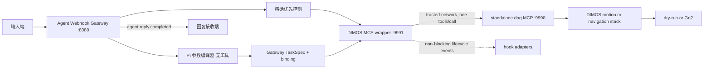

    # 项目 Context

## 项目范围

本仓库是以 Pi 为基础的组合仓库。自研机器人能力统一放在 `components/`，并拆分为两个可独立安装和部署的组件：机器狗侧 `components/dimos-mcp` 与上层 `components/agent-framework`。当前硬件探索目标是使用 [DIMOS](https://github.com/dimensionalOS/dimos) 将 Agent 的 MCP 工具调用连接到机器狗。

`packages/` 保留 Pi 上游包的原有布局，作为 Agent Framework 使用的基础依赖，不属于第三个机器人部署组件。组件之间只能通过公开协议连接，不得通过相对路径导入彼此的内部代码。

根 `CONTEXT.md` 是该仓库的单一领域 context。变更机器人、MCP 或 Agent 集成前，应先阅读本文件；如存在相关 `docs/adr/` 决策，也必须一并阅读。

## DimOS 三阶段融合状态

当前权威执行计划位于
`/Users/johnsonmac/ai_completion/dimos/docs/plans/2026-07-25-go2-three-stage-robot-validation-plan.md`。
长期融合架构和后续 backlog 保留在
`/Users/johnsonmac/ai_completion/dimos/docs/plans/2026-07-25-go2-agent-fusion-master-plan.md`。
当前计划只执行三个可真机复查的闭环：基本控制/返回/停止、已知语义地点导航、
视觉搜索与戒指触发。
目标不是同时运行本仓库和 DimOS Studio 的两套机器人 Runtime，而是让
`components/dimos-mcp` 成为唯一产品组合/启动入口，并加载已安装的
`dimos-go2-studio` P1/P2/P3 模块。DimOS/Python 继续唯一负责任务状态机、语义地图、
感知、导航、恢复和物理完成判断。

`components/agent-framework` 继续只通过 HTTP MCP 访问底层。Pi Agent 只负责把用户
语言编译成受约束的任务参数；Gateway 负责 `instruction_id` 与 `task_id` 的持久化
绑定；Wrapper 的 product profile 暴露高层任务、官方地点标记/文本导航、状态和停止
工具。低层运动、探索和 sport action 只属于显式 maintenance profile。

Stage 1 已完成真实 Go2 control/return/stop 复查。Stage 2 的 S2-T1/T2/T3/T4
软件任务已完成：朋友 `dimos-mcp` 在单一 Runtime 内加载一个 `SemanticWorld`
和一个 `MissionExecutor`；Agent/Gateway 已实现 product 参数编译、稳定 task ID、
SQLite binding、单次提交和终态监控；Studio 已能确认当前位置、选择地点、提交/
取消 canonical task，并只读显示必要的 canonical 摘要。Stage 2 现已增加预建图和官方
`RelocalizationModule`，语义地点持久化在 `map` 帧并按当前会话转换到 `world`
帧；缺少变换时 fail-closed。用户已确认 S2-R1 完成，当前进入 S2 收尾；本轮官方
能力补回只做软件接线验证，不重复声称新的真机到达。不得同时启动朋友 robot MCP
和 Studio Go2 Blueprint 控制同一台狗。

Stage 2 的可视化现在也服从同一所有权：官方 planner `path` 直接进入既有
`RerunBridgeModule`；`RobotSummary` 发布它已经采样的 odometry 点；一个只读
`SemanticVisualizationAdapter` 将该轨迹点、`SemanticWorld` 地点快照和
`MissionExecutor` 状态快照转换成实际轨迹、命名地点和当前目标的 Viewer entity。
Adapter 没有 MCP skill、导航接口或硬件连接。Studio 只保留地点命名、路线选择、
指令提交及 instruction/reply 幂等证据，不能持久化或恢复机器人任务状态。旧
`/api/mission/*` 路由和浏览器轮询已从当前 App 移除，旧控制器仅保留为未实例化的
回滚源码；Studio 急停只转发唯一 Wrapper MCP 的 `stop_all`。

Agent 输入协调现已继续在既有 Gateway 内收敛：自然语言可编译为单地点导航、
当前位置标记、有限命名路线或官方人员跟随；精确暂停/继续/取消/状态和小步方向
输入走现有持久化优先队列。标点与路线复用 canonical `SemanticWorld` /
`MissionExecutor`，方向输入复用官方 `relative_move`，没有新增 Agent、MCP 层、
导航器或设备 SDK。本轮只完成 fake-MCP 软件验证，未连接戒指、眼镜、ASR 或 Go2。

Gateway 现在同源托管唯一的本地 Agent Console `:8080/`。该前台只提交现有
`/v1/instructions`、读取 SQLite 中已经存在的 instruction/task/outbox 状态，并
iframe 嵌入同一 Product Runtime 的官方 Rerun web viewer `:9878`。它不连接 Go2、
不调用 MCP、不保存地图，也不成为第二个任务状态 Owner。默认回复回调指向同进程
`/v1/ui-replies`；该端点只核对已持久化回复，外部回调仍可配置覆盖。

## 对外使用文档

根 [USAGE.md](USAGE.md) 是框架使用者的公开使用与开发指南，覆盖上层 MCP Host 接入、下层机器狗接入、配置、hook 和扩展流程。

每次新增、删除或改变用户可见功能时，必须同步更新 `USAGE.md`。工具、参数、端点、环境变量、硬件适配方式、hook 契约和运行前置条件均属于用户可见功能；若变更还影响本文件中的术语、架构边界或安全不变量，也必须同时更新 `CONTEXT.md`。

## 组件与术语

| 名称 | 位置 | 职责 |
| --- | --- | --- |
| 机器人组件目录 | `components/` | 组合仓库中两个可独立部署组件的唯一根目录。 |
| 独立底层机器狗 MCP | `components/dimos-mcp` | 唯一产品 Runtime；默认 product profile 公开 20 个任务/官方地点导航/人员跟随/受控相对位移/状态/停止工具，maintenance allowlist 为 32 个调试与任务工具；组合一个 Go2、官方空间记忆/导航/人员跟随技能、一个语义世界、一个任务执行器、一个只读 Viewer Adapter 和一个 MCP Server。 |
| Agent Framework | `components/agent-framework` | 部署在上层机器，组合固定 Pi Agent 会话、MCP 包装器、输入网关与回复投递器。 |
| MCP 薄包装器 | `components/agent-framework/dimos-mcp-wrapper` | 独立 DIMOS MCP 服务，转发同名工具到上游 MCP，并发出生命周期 hook。 |
| 上游 MCP | 默认 `http://127.0.0.1:9990/mcp` | 真正执行机器狗命令的服务。 |
| 包装器 MCP | 默认 `http://127.0.0.1:9991/mcp` | MCP Host 应连接的服务。 |
| 生命周期 hook | `McpCallHook` | 对转发事件做最佳努力处理的旁路；不是权限检查器，也不是命令改写器。 |
| 外部指令事件 | 输入端契约 | 带稳定 `instruction_id` 的已确认用户请求文本；重试时 ID 不变，在投递前不等同于 Agent 会话消息。避免称其为 MCP 调用或机器狗命令。 |
| 语音停止口令 | 输入网关快速路径 | 规范化后精确等于“停”或“stop”的外部指令事件。它绕过 Agent 会话并触发 `stop_all`，但不等同于独立物理急停。 |
| 优先控制输入 | 输入网关快速路径 | 精确暂停、继续、取消、状态或小步方向文本；与停止共用持久化优先队列，绕过模型。方向固定先 `stop_all` 再 `relative_move`，会取消当前自主任务且不自动恢复。 |
| 估算距离运动 | Agent 运动语义 | 用户以距离或距离加时长表达的运动请求。方向可选且默认向前；Agent 将其换算为经部署标定的有限时长速度指令。它是距离估算，不是定位或到达保证。 |
| 输入网关 | `components/agent-framework/agent-webhook-gateway` | 外部指令事件进入 Agent 前的唯一受理边界。避免称其为 MCP Server 或机器狗控制器。 |
| Agent 参数编译器 | 部署内运行时 | product 中一个无 MCP/coding tools 的 Pi session，只输出严格 `go_to_place`、`mark_place`、有限 `visit_route` 或 `follow_person` 参数；不能生成 task ID、时间戳、工具参数或终态。 |
| instruction/task binding | Gateway SQLite | `instruction_id` 到 deterministic `task_id` 和 canonical `task_json` 的唯一持久化绑定。 |
| Agent 回复事件 | 回复端契约 | 与 `instruction_id` 关联、带稳定 `reply_id` 的用户可见最终文本。Agent 无法完成时，文本固定替换为用户可见的回退语；避免称其为 MCP 结果或模型 token 流。 |
| 输出投递器 | `components/agent-framework/agent-webhook-gateway` | 从持久化 outbox 向回复接收端的回调地址投递 Agent 回复事件。避免称其为 MCP hook。 |

## 不变量

1. 机器狗动作的参数验证、并发控制、零速度结束、dry-run/Go2 选择，以及 Go2 地图、规划、探索、巡逻和散步实现属于上游机器狗 MCP；包装器不得复制或绕过这些逻辑。
2. 每个包装器工具调用最多向上游发送一次 `tools/call` 请求。不得自动重试运动命令。
3. 包装器必须原样转发已公开工具的名称和参数，并返回上游的文本结果或清晰的上游错误。底层预期错误使用 `{"status":"error","error":"..."}` 文本 envelope；包装器和 Agent 网关还必须识别 DIMOS 将异常包装成的 `Error running tool '...'` 文本，不能把它当作成功。
4. `stop_all` 优先于 hook：请求必须立刻转发，hook 不能让它等待、重试或被吞掉。包装器只转发一次；探索、巡逻、散步、持续视觉查找、导航和定时速度的停止编排属于底层。
5. hook 事件为 `before_call`、`after_success`、`after_error`、`finally`。事件按 FIFO 入队，但 hook 不在 MCP 调用路径上执行，因此 `before_call` 不是前置拦截器。
6. hook 失败只能记录日志，不能改变上游请求、返回值或错误。hook 的投递是最佳努力，不保证在包装器进程退出时完成。
7. 当前没有确定“发送其他指令”的协议。不得先行增加假设性的 `send_instruction` MCP 工具、网络协议或硬件 SDK；确定协议后，以具体 hook/适配器接入。
8. 输入网关仅在外部指令事件持久化后返回 `202 Accepted`；该确认不表示 Agent 已处理、模型已响应或任何机器狗动作已执行。
9. 输出投递器必须先持久化 Agent 回复事件，再发起回调。回调失败只能重试投递，不得重新运行 Agent 或重复任何机器狗工具调用。
10. 每个回复事件只交付完整终态文本。product 的完成/失败/取消文本由 Gateway 根据
    canonical terminal snapshot 确定性生成，不能由模型声称。
11. 每个部署只有一个固定 product 参数编译 session；输入网关不得接受外部 Agent
    或会话路由标识。该 session 的 active tools 必须为空。它的 provider、model ID
    和 base URL 必须由 Gateway 显式配置，不能隐式继承用户当前 Pi 模型。
12. 当前普通 instruction/reply Webhook 不提供身份校验、签名或重放防护；它们只能被视为受信任环境内的临时集成边界，不得被描述为安全的公网接口。
13. 输入网关承载异步自然语言事件和有限的精确优先控制，不是连续实时控制或独立
    物理急停路径；停止和小步方向输入也不能替代直接物理安全路径。
14. 普通外部指令按持久化受理顺序串行处理；一个 canonical task 达到 terminal
    且 `active=false` 后才开始下一普通事件。优先控制输入可在任务监听期间并行抢占。
15. Agent 无法产出最终回复时，输出投递器仍发送普通的 `agent.reply.completed` 事件，并将 `text` 固定为“暂时无法完成此请求，请稍后重试。”；不得向下层暴露失败事件、原始异常、工具错误或部分模型文本。
16. 停止及其他优先控制在持久化与幂等登记后必须绕过 Agent 会话队列；任何不精确
    匹配的文本不得进入该路径。方向输入必须固定先调用一次 `stop_all`，再调用一次
    `relative_move`，模型不得决定位移参数。
17. 语音停止口令的 `stop_all` 调用被 MCP 接受后，输出投递器必须以普通的 `agent.reply.completed` 事件回复“已发送停止指令。”；调用失败或任一底层停止组件失败时则回复既定的通用失败文本，不得声称机器狗已静止。
18. 输入网关信任输入端已将每个 Webhook 确认为完整真实请求；它不采集音频、不做 ASR、唤醒、分段或用户意图判断，并将 `text` 作为不透明文本处理。
19. Stage 1 validation 中，可执行的距离运动必须有完整参数并受 1 米验收界限；这些
    低层语义不属于 Stage 2 product Agent。
20. product 参数编译只接受 `go_to_place + destination`、`mark_place + name`、
    有限 `visit_route + waypoints + repeat_count` 或无额外字段的 `follow_person`。
    空地点、无限循环、额外字段、未知 kind、Markdown 或模型提供的 task ID 必须
    fail-closed。`follow_person` 直接启动官方后台技能，不创建 canonical binding。
21. Gateway 在物理调用前持久化 binding。单地点每个 task ID 只提交一次；有限路线
    的每一段生成不同的确定性 task ID，并只在上一段 completed 后提交。进程恢复时，
    submitted/monitoring 只轮询；compiled binding 可用相同 ID 恢复提交；未绑定的
    旧 processing 指令 fail-closed。
22. 下层 maintenance profile 的版本化 allowlist 是 32 个工具；默认 product 是
    20 个任务、官方地点导航、人员跟随、受控 `relative_move`、状态、观察和停止工具。Wrapper product 与下层 product 对齐，validation 精确为
    Stage 1 五工具。maintenance 实际发现结果还受当前 Blueprint 已组合模块限制。
    升级 DiMOS 时必须重新审计。
23. 17 个受支持的官方工具在 Go2 模式中必须由 DiMOS 官方模块或官方 `McpServer` 实现。dry-run 除本地管理工具外只能返回明确的 `required_mode=go2` 错误，不得伪造遥测、感知、定位、路径、探索、巡逻、跟随或动作成功。
24. 定点导航、返航、Frontier 覆盖探索、已建图巡逻和人类式散步是不同生命周期。`return_to_start` 使用下层进程启动后捕获的第一帧有效里程计作为会话起点，距离起点不超过 0.20 米时不得向规划器提交目标；完整提前终止入口为 `stop_all`，官方 `stop_navigation` 只取消当前导航目标。底层必须保留其余专项停止能力供内部编排，并在某一项失败后继续尝试其余停止动作，最后尝试本地零速度。
25. `start_patrol` 只在已经建图的区域按官方覆盖路由持续巡视。`start_stroll` 使用官方 Frontier 检测与导航，但在每个局部未知分支决策点随机选择一条、退休同一决策点的其他分支、拒绝回头补覆盖；无顺向候选时结束。该策略有意遗漏可探索区域，不得描述为巡逻或完整探索。
26. Stage 2 底层 Go2 Blueprint 组合官方 `SpatialMemory(new_memory=false)`、
    `NavigationSkillContainer` 与一个 `PersonFollowSkillContainer`，但不得组合
    官方 `McpClient`、任何第二 LLM Agent 或
    `PerceiveLoopSkill`。官方地点导航与 canonical `SemanticWorld` / `MissionExecutor`
    共用唯一 navigator；不得再建立第三套地点、Planner 或 Agent 框架。
27. Go2 实机入口必须等待 `ModuleCoordinator.build()` 完成官方模块启动，再通过锁定版 `GO2Connection.publish_request` 向官方 Sport endpoint 发送 `SwitchJoystick`（API `1027`，`data=true`），显式启用 `cmd_vel` 使用的固件输入。响应状态码不为 `0`、响应结构无效或调用抛出异常时，必须停止 coordinator 并让进程启动失败；不得进入服务主循环或声称 MCP 已就绪。状态码成功不是独立的底盘运动证明，dry-run 不执行该调用。
28. product Pi 编译器没有任何工具，因此不能调用 Bound、空翻或其他运动。直接
    maintenance MCP Host 仍不受此限制；Stage 1 validation Agent 也不注册 sport
    工具。
29. 官方 tagged-location/文本导航/导航取消进入 Stage 2 product 工具面；
    `return_to_user_and_greet` 仍保留为 maintenance 资产。官方地点集合与 canonical
    `SemanticWorld` 是两个兼容入口，验收时必须明确本次使用哪一个，不能混称证据。
30. product 主语言模型、Stage 1 `ValidationUserTextAgent`、Stage 3 视觉 verifier
    与官方人员跟随的 Qwen VL 是独立配置。更换任一模型不得改变其他链路。模型密钥只允许来自
    macOS Keychain 或进程环境，不能进入仓库、SQLite、任务记录或日志。
31. `follow_person` 必须复用 DimOS 官方 `PersonFollowSkillContainer`：Qwen VL
    只做首次 bbox，EdgeTAM 和 `VisualServoing2D` 负责后续本地跟随。不得再实现第二套
    tracker。该官方技能明确不做障碍物避让，也不自动重识别丢失目标；`stop_all`
    必须调用官方 `stop_following`。任何软件测试不得被描述为杂物/人流真机跟随通过。
32. Agent 标点以 canonical `SemanticWorld` 为唯一地点真相：Gateway 只从 fresh
    odometry 和 ready relocalization 取得稳定 pose，再调用
    `confirm_semantic_place`。官方 `tag_location` 仍保留给官方
    `navigate_with_text` 入口，但不得与 Agent 路线证据混称，也不得让路线同时写
    两份地点状态。
33. Viewer Adapter 只能消费 canonical 快照并发布可视化 entity；不得暴露 skill、
    调用导航、连接 Go2 或维护第二份任务状态。规划路线始终来自官方 planner
    `path`，实际路线只能来自 `RobotSummary` 已接受的 odometry 样本。
34. Agent Console 只能调用 Gateway HTTP 输入/只读查询端点和嵌入官方 Viewer。
    浏览器不得直连 `:9990/:9991`，不得通过 `:3030/ws` 发送 Viewer 控制事件，也
    不得保存或推导另一份机器人任务状态。Console 的停止按钮只提交精确文本“停”。

## 运行约束

- DIMOS `0.0.14b1` 要求 Python 3.10 至 3.12；本开发机的 Python 3.14 只能运行不依赖 DIMOS 的纯单元测试。
- 默认 MCP 安装 `dimos[web]==0.0.14b1` 以及 DIMOS 技能 schema 生成实际需要的 `langchain-core==1.5.0`；Go2 extra 安装 `dimos[cuda,misc,perception,unitree]==0.0.14b1`，并将 ONNX Runtime CPU/GPU 固定为 CUDA 12 对应的 `1.26.0`。CPU/GPU wheel 提供同名 Python 包，环境安装必须以 GPU wheel 覆盖收尾。真机启动脚本在连接 Go2 前把虚拟环境 NVIDIA wheel 的动态库加入当前进程并验证 `CUDAExecutionProvider`，避免安装顺序或 CUDA 版本漂移在硬件连接后才使感知 worker 崩溃。官方人员跟随使用独立 `DIMOS_QWEN_VL_*` 配置，真实 key 只允许位于私有启动配置或进程环境。
- 上游机器狗 MCP 默认 dry-run。实机 Go2 操作仍需显式设置上游的 `DIMOS_DOG_MCP_MODE=go2`，并满足场地隔离、独立急停和官方网络预检。
- Go2 入口在官方 `StandUp` / `BalanceStand` 初始化完成后显式执行一次 `SwitchJoystick` Sport 请求。该调用不增加 MCP 工具或环境变量；响应状态码不为 `0`、响应结构无效或调用抛出异常会终止启动，避免导航正常规划但底盘静默忽略 `WIRELESS_CONTROLLER` 速度帧。
- 独立底层 MCP 默认只监听 `127.0.0.1:9990`。跨机器调用时必须显式设置 `DIMOS_DOG_MCP_HOST=0.0.0.0` 或指定 interface 地址，并通过受信任网络和主机防火墙限制访问。
- 包装器默认请求超时为 120 秒，配置通过 `DIMOS_MCP_WRAPPER_*` 环境变量提供，以覆盖同步等待导航终态的组合工具。它不直接打开硬件连接。
- Agent Webhook Gateway 要求 Node.js 22.19 或更高版本，使用 Node 原生 SQLite
  持久化 inbox/outbox。product runtime 默认显式使用 SiliconFlow
  `zai-org/GLM-5.2` 的 OpenAI-compatible Chat Completions；API key 默认从专用
  macOS Keychain service 读取。validation runtime 不依赖模型 API。普通机器狗
  MCP 调用默认超时为 120 秒。

## 测试 seam

- 上游 MCP seam：标准 JSON-RPC `tools/call`、profile-specific allowlist、单次
  调用、文本结果与错误传递。
- hook seam：hook 非阻塞、只读、异常隔离。
- DIMOS MCP seam：product 精确发现 20 个高层/官方地点导航/人员跟随/受控相对位移/只读工具，
  maintenance allowlist 为 32 个；Go2 Blueprint 只有一个连接、一个官方空间记忆、
  一个官方导航技能、一个官方人员跟随技能、一个语义世界、一个任务执行器、一个
  navigator 和一个 Server。
- 回到用户并问候 seam：`return_to_user_and_greet` 只接受实际名称精确为“用户身边”的标点，确认导航成功后才等待至少 1 秒并执行 `Hello`；任何前置步骤失败都不得执行问候。
- Go2 Blueprint seam：静态组合中所有必需模块引用必须可解析；Stage 2 组合必须
  各包含一个 `SpatialMemory`、`NavigationSkillContainer` 与
  `PersonFollowSkillContainer`、一个 `SemanticVisualizationAdapter`，并排除
  `PerceiveLoopSkill` 和 `StandaloneAgentBridge`。
- Go2 locomotion seam：官方模块完成启动后，入口必须对已部署的唯一 `GO2Connection` 通过 `publish_request` 发送一次 API `1027` / `data=true`；响应状态码不为 `0`、响应结构无效或抛出异常必须使启动失败。
- 输入 Webhook seam：严格请求 schema、持久化后 `202`、稳定 `instruction_id` 幂等与冲突响应。
- Agent runtime seam：product Pi session active tools 为空；Gateway 生成稳定 task
  ID、持久化 binding、有限路线进度、逐段提交并等待 terminal + inactive；
  validation 精确使用五个验收工具。
- 输出 Webhook seam：完整终态回复、稳定 `reply_id`、失败重投与进程恢复均不得重跑 Agent 或 MCP 工具。
- 优先输入 seam：停止、任务 lifecycle、状态和六个固定方向只做有限礼貌外壳加
  全句锚定口语匹配并绕过 Agent；方向固定 `stop_all -> relative_move`。否定句、
  带目的地/距离的句子和复合动作不得误入物理快捷路径。

这些名称应直接用于后续的实现、测试、Issue 和设计讨论，避免将包装器误称为机器人控制器或将 hook 误称为同步拦截器。

## Recent task log

### 2026-07-26 — Agent 自然语言动作入口收敛

- Changed: 扩展既有 priority/manual 入口，让“往前走、请你向左走一下、马上停”
  等有限中文口语确定性映射到既有 `stop_all -> relative_move` 或 `stop_all`；
  地点、标记、路线和人员跟随仍由原有无工具 taskCompiler 生成 canonical 任务。
  新增 MCP 稳定错误分类，前台不再把失败回复显示为“已完成”。
- Boundaries: 没有给模型开放速度、距离或任意 MCP 工具；平移仍固定 0.2 m，转向
  仍固定 15°。否定、复合、带目的地或带距离的文本不会命中物理快捷路径。
- Files: Gateway `service.ts`、`mcp-client.ts`、Console `web/`、相关测试、
  README/USAGE/CONTEXT，以及 DimOS 设计与 `PROJECT_CONTEXT.md`。
- Checks: Gateway 全套 `81/81`、TypeScript、build、JavaScript syntax 和两仓库
  `git diff --check` 通过；真实 Runtime 尚未启动，本任务没有发送运动指令。真机
  验收必须先证明唯一 Runtime、20 个 product tools、fresh odometry 与 Viewer 在线。

### 2026-07-26 — 独立 Go2 Agent Console

- Changed: 在现有 `agent-webhook-gateway :8080` 同源增加地图、文字输入、任务状态、
  最终回复和停止按钮；新增只读 instruction 查询与本地 reply 确认端点。地图直接
  嵌入同一 Runtime 的官方 Rerun web viewer `:9878`，没有新建 Runtime、Planner、
  MCP、Agent 或数据库。
- Startup: 新增可双击的 `启动 Go2 Agent 控制台.command`。它只在确认 `:9990` 是
  现有 `dimos_dog_mcp.blueprint` 后 attach/start Wrapper 和 Gateway；不会自行连接、
  站立或移动 Go2，也不会结束未知端口 Owner。Product env 改为
  `RERUN_OPEN=none/RERUN_WEB=true`，避免额外页面。
- Files: Gateway HTTP/config/store/service、`web/` 静态前台、focused tests、
  `.env.example`/README/USAGE、ADR 0003、启动脚本、DimOS 设计与 Context。
- Checks: Gateway focused TypeScript tests 34/34、typecheck、build、浏览器 fake-Agent
  提交/回复视觉验收、shell syntax 和 `git diff --check` 通过。未启动真实 Runtime、
  Wrapper 或 Product Agent，未连接或移动机器狗。
- Unresolved: 真实地图和 Agent→Wrapper→MCP 链路必须等操作者显式启动唯一
  Product Runtime 后再验收；当前所有产品端口均为空闲，不能描述为已在线。

### 2026-07-25 — Stage 2 官方 Viewer 只读语义可视化

- Changed: `SemanticWorld` 和 `MissionExecutor` 分别发布地点/任务状态快照；
  `RobotSummary` 只发布它已接纳的 actual-path 单点；新增一个无 skill、无硬件连接
  的 `SemanticVisualizationAdapter`，将其转换成官方 `EntityMarkers` 和蓝色
  actual path。官方 planner `path` 继续由既有 `RerunBridgeModule` 直接显示，
  没有复制 Planner 或规划路线。Studio 删除自绘轨迹、旧 Mission UI/轮询并卸载
  `/api/mission/*`；E-STOP 改为单次调用 canonical `stop_all`。
- Startup: Go2 示例和脚本默认 `VIEWER=rerun`、`RERUN_OPEN=native`。
- Files: `components/dimos-mcp` Blueprint、robot summary、新 Adapter/测试、启动配置，
  `dimos-go2-studio` 语义世界/任务执行器快照及测试，`USAGE.md` 和本文件。
- Checks: DimOS extension + Stage 2 Studio/冻结 legacy 回归 81/81；朋友 MCP 非集成 65/65、
  隔离集成 14/14；focused Ruff、launcher `bash -n` 和两仓库
  `git diff --check` 通过。本任务命令没有启动机器人进程或发送运动命令。
- Read-only live check: 23:08 出现的当前 product Runtime 主 PID `79657`
  已在 `9990/7779` 提供服务；`get_robot_summary` 为 `ready`、fresh odometry、
  task idle。该进程不是本任务命令启动；本任务仅做只读 MCP 检查。
- Live boundary: 当前 `relocalization.ready=false` /
  `transform_unavailable`，所以 Adapter 会按设计拒绝把 `map` 点位错误画到 `world`
  帧。actual path 可发布，但命名点位/目标的真机可见性仍需重定位恢复后确认。
- Packaging: `components/dimos-mcp` 的 Python 范围已收紧为
  `>=3.12,<3.13`，与 `dimos-go2-studio` 和实际 DimOS 运行环境一致。
- Unresolved: 根 `npm run check` 的 pinned-dependency 扫描会进入既有
  `components/dimos-mcp/.venv`，把 Dash/Plotly 自带的 Jupyter
  `package.json` 误当仓库依赖并失败；Python/Viewer 回归不受影响。

### 2026-07-25 — 房间前沿探索与自动语义踩点

- Changed: 未修改控制代码。复用朋友 MCP 内已有
  `StrollSkill(WavefrontFrontierExplorer)` 做一次受限房间探索，并按稳定
  `map` 坐标每跨约 `0.8 m` 调用既有 `confirm_semantic_place`，保存
  `房间点位-01` 至 `房间点位-06`；`房间点位-01` 的别名为 `房间起点`。
  发现探索前重定位变换仍在更新后，又从同一 Runtime 的 `actual_path` 按各标点
  时间取回原始 `world` odometry，并用同一份当前变换重投影六个地点，避免把
  不同时刻的 `world -> map` 结果混在一条路线里。
- Live evidence: 唯一 Runtime owner PID `67504`，Go2
  `192.168.12.1`，WebRTC/数据通道、fresh odometry 和官方重定位均 ready。
  探索约 `14 s`，实际 odometry 累计 `5.339 m`；最终 `stop_all` 成功，
  后续实测 `stationary`、`0.001 m/s`，重定位仍 ready。
- Architecture boundary: 底层为临时 maintenance profile，便于调用现成
  `start_stroll`；对 Agent/Gateway 暴露的 Wrapper 继续保持 product allowlist，
  未暴露 `execute_sport_command` 等维护动作，也未启动第二个 Runtime。
- Validation boundary: 已证明自动前沿移动、同一 Runtime 内一致的地图帧自动标点
  和统一停止；尚未执行用户指定的多点路线。六个相邻点重投影后相距
  `0.900–1.111 m`。官方重定位此前连续接受过不同变换，因此
  `relocalization.ready=true` 不能单独证明跨重启稳定；本轮点位先用于当前会话
  路线，重启复用仍需单独验收。
- Checks: 端口 `9990/9991/8080` 各只有一个监听者；停止后再次查询
  `get_robot_summary`，里程计 fresh、机器人静止、重定位 ready；两仓库
  `git diff --check` 通过。重投影后连续 `10 s` 静止采样的 map 平面最大漂移为
  `0.0008 m`。

### 2026-07-25 — Agent 命名点位、有限路线与任务控制真机复查

- Changed: 未修改控制代码；使用唯一 product 链路
  `Gateway :8080 -> Wrapper :9991 -> DimOS MCP :9990 -> Go2 192.168.12.1`
  真机运行既有 `mark_place`、有限 `visit_route`、暂停、继续、取消、状态和统一停止。
  Runtime 使用本地 Hugging Face/CLIP 缓存离线启动，避免模型元数据网络重试阻塞
  WebRTC。
- Live evidence: Runtime owner PID `65058`，fresh odometry、camera/LiDAR 与
  `world -> map` 重定位 ready；保存 `Agent测试起点`、`Agent测试点B`，地图平面距离
  `0.625 m`。一次受控 `relative_move(0.8 m)` 的真实净位移为 `0.7671 m`。Agent
  路线 `起点 -> B -> 起点` 完成，末端距起点 `0.0166 m`，三个逐段任务均由
  `MissionExecutor` 等待 terminal + inactive；随后两轮路线在导航中成功
  `paused -> resumed/moving -> cancelled`，取消原因是
  `operator cancelled task`。最终 `stop_all` 回复完成，机器人
  `stationary`、本地运动 `idle`、任务 inactive。
- Validation boundary: 本次证明真实 Agent 输入、MCP 权限转发、语义点位、有限路线
  和任务生命周期联动；未测试语音、戒指、眼镜、人员跟随、重启恢复或临时阻挡。
  `get_robot_summary.distance_travelled_m` 包含启动漂移和准备移动，不能当作单次路线
  长度。
- Unresolved: 固定方向输入当前使用 `relative_move(0.2 m)`；官方导航到达容差会在
  几乎未移动时直接返回 `Navigation goal reached`。本次仅观测到约 `0.0261 m`
  净位移，因此该六方向短步功能不算通过。后续应把手动短步改为与导航容差解耦的
  官方速度/短步适配，或提高步长并用 odometry 做完成判定。
- Runtime left running: MCP owner `65058` / worker `65078`，Wrapper `65278`，
  Gateway `65302`，本地回复接收器 `65255`；只保留这一套控制栈，没有打开新网页。

### 2026-07-25 — 既有 Agent 输入协调与有限命名路线

- Changed: 在既有 Agent Webhook Gateway 内扩展严格 `mark_place` 和有限
  `visit_route` 参数；标点复用 `get_robot_summary -> confirm_semantic_place`，
  路线逐段复用已有 `go_to_place` / `MissionExecutor`；暂停、继续、取消、状态及
  六个固定方向进入原有持久化优先队列。product MCP/Wrapper 只新增公开已有
  `relative_move`，其余低层运动仍隐藏。
- Why: 先把语音、未来戒指与眼镜需要的机器人能力在现有 Agent 中统一协调，避免
  新建 Agent、状态机、MCP 层、地图或导航框架。
- Files: Gateway task contract/service/store/prompt/tests/README；MCP 与 Wrapper
  product allowlist/profile tests；根 `USAGE.md`、本文件和 Webhook 对接文档。
- Checks: Gateway 7 files / 48 tests、TypeScript check/build、Wrapper 16/16、
  底层 Blueprint/profile 8/8、底层 dry-run integration 14/14、Ruff 与
  `git diff --check` 通过。根 check 的 imports/shrinkwrap/install-lock/browser
  smoke 通过；聚合 check 被本地 `.venv` 的第三方 Jupyter/Plotly 未固定依赖阻断，
  根 `tsgo` 仍被 `packages/ai` 既有 model-catalog 类型错误阻断。
- Validation boundary: 全部使用 fake MCP 或静态 Blueprint；未启动服务、未连接或
  移动 Go2，未接入 ASR、戒指或眼镜。
- Next: 设备接入时只把识别后的文本/确定性方向写入现有 `/v1/instructions`；眼镜
  读取已有 map/pose/task/actual_path，不新增第二个任务或地图 Owner。

### 2026-07-25 — 复用 DimOS 官方中央人员跟随

- Changed: Go2 product Blueprint 恢复一个官方 `PersonFollowSkillContainer`；
  product MCP/Wrapper 公开 `follow_person`，Gateway 将明确的“跟着我”编译为固定的
  中央人物 query；`stop_all` 新增官方 `stop_following`。
- Why: 官方 DimOS 已包含 Qwen 初检、EdgeTAM 本地跟踪和视觉伺服，不应再复制一套
  tracker。自研工作仅保留 provider/MCP/Agent 适配。
- Files: friend Gateway、MCP、Wrapper、配置/启动脚本/测试/文档；相邻 DimOS 的
  Qwen provider 与 bbox 解析适配；官方跟随子计划。
- Checks: Gateway 20/20、DimOS provider/bbox 6/6、friend Blueprint 8/8、
  MCP integration 14/14、stop 3/3、Wrapper unit/integration 5/5、launcher 3/3。
  真实 SiliconFlow
  smoke 使用非机器人测试图，经官方 Qwen/解析链返回像素 bbox，约 4 秒。
- Validation boundary: 本轮没有连接或移动 Go2。官方跟随直接发布视觉伺服速度，
  明确不做避障、不自动重识别，也没有 canonical task binding/终态。
- Next: 在清空直线路径上单人站在画面中央，独立验证启动、短距离跟随、目标丢失
  停止和用户“停”；杂物/人流环境必须先升级为障碍感知动态导航。

### 2026-07-25 — 恢复官方 S2 地点导航

- Changed: friend Go2 Runtime 补回官方 `SpatialMemory(new_memory=false)` 与
  `NavigationSkillContainer`；底层 MCP 和 Wrapper product profile 同步恢复
  `tag_location`、`navigate_with_text`、`stop_navigation`。
- Why: S2 收尾不再扩建自研地点/导航框架，直接复用 DiMOS 已有能力；现有
  `SemanticWorld`、`MissionExecutor`、单 Runtime 和统一 `stop_all` 保持不变。
- Files: friend MCP Blueprint/tool contract/tests，Wrapper forwarding/profile/tests，
  根 `USAGE.md`、两个组件 README 和本文件。
- Checks: focused Blueprint/profile/forwarding tests、Ruff 与 `git diff --check` 通过；
  根 `npm run check` 被仓库内本地 `.venv` 的第三方 Jupyter/Plotly `package.json`
  非精确依赖拦截；未启动 Go2、未发送运动。
- Unresolved: 官方 `NavigationSkillContainer` 自带图像/语义回退依赖；本轮只验证
  软件组合与工具暴露，未声称已完成真机导航。
- Next: 重启唯一 product MCP/Wrapper 后先用 `tools/list` 确认三个官方工具，再选
  一个已清场地点做单次 `tag_location -> navigate_with_text` 真机验收。

### 2026-07-25 — Stage 2 稳定地图帧与真机只读预建图

- Changed: friend Go2 Runtime 增加必需的 `DIMOS_PREMAP_FILE` 和官方
  `RelocalizationModule`；`SemanticWorld` 在确认地点时把 `world` 转换为稳定
  `map` 帧，导航时再转换回当前 `world` 帧；摘要增加重定位 readiness；启动入口
  自动把机器人 IP 加入大小写两个 `NO_PROXY`。
- Why: 原实现持久化原始 odometry，Runtime 重启后地点坐标会漂移；macOS 系统代理
  还会截获 `192.168.12.1` 的 `/con_notify`，表现为错误的 WebRTC 502。
- Files: friend MCP config/Blueprint/summary/launcher/tests/docs；共享
  `semantic_world.py` 及其测试；Stage 2 audit CLI/tests；根 `USAGE.md` 和本文件。
- Audit: 新增只读 preflight、单程 trip 和 cancel-check。它在 `start_task` 前
  强制核对 Runtime/PID、fresh odometry、relocalization、当前 map/version 地点
  和无活动任务；每次只提交一次任务，记录精确 task ID、终态、稳定帧到达误差，
  timeout 只取消一次并要求 `navigation_idle=true`。
- Checks: 共享扩展 50/50、friend MCP 74/74、聚焦启动/运动测试通过；两仓库
  Ruff 通过。根 `npm run check` 的 Biome 通过，随后被本地生成的
  `components/dimos-mcp/.venv` 内第三方 Jupyter/Plotly `package.json` 的
  unpinned dependency 阻断；单独执行的 imports、shrinkwrap、install-lock 和
  browser smoke 通过，`tsgo --noEmit` 仍被 `packages/ai` 既有 model-catalog
  类型错误阻断。只读真机连接达到 ICE completed、peer connected、
  data-channel verification OK，并收到新鲜 camera/LiDAR/odom；没有站立或
  运动指令。
- Runtime evidence: 只读记录导出为
  `~/.dimos/go2-stage2/venue-s2-recording.pc2.lcm`，35,357 点，SHA-256
  `61d67bd5e8447b4732a8cba19ffd331d097d409ce175f2f5b02fa066f0d5966f`。
  官方离线重定位按设计拒绝该静态局部图：约 35.7k 点少于 50k 最低阈值。
- Unresolved: 必须在明确清场授权后让 Go2 做一次短距离受控移动，累积更多几何并
  取得真实 `world -> map` 变换；随后才能确认两个地点并执行 S2-R1。
- Next: 收到 `START GO2，场地已清空` 后只启动一个 friend product Runtime，
  先验收重定位 readiness，再做三次语义单程、重启恢复和临时阻挡测试。

### 2026-07-25 — product Agent 显式 SiliconFlow GLM-5.2 provider

- Changed: product Pi task compiler 不再继承用户当前 Pi 模型；Gateway 增加显式
  provider/model/base URL/API-key source，默认使用 SiliconFlow
  `zai-org/GLM-5.2`。Pi session 不请求 reasoning effort，但 SiliconFlow 服务端
  仍可能返回 reasoning token。API key 存入专用 macOS Keychain 条目；
  validation 规则 Agent 和视觉 verifier 保持独立。
- Why: 主 Agent、真机 validation 和视觉验证原先容易被误认为同一个“模型”；
  隐式继承 Pi 设置也无法确认实际 provider。
- Files: Gateway `config.ts`、`model-provider.ts`、`agent-runtime.ts`、`cli.ts`、
  tests、`.env.example`、README、根 `USAGE.md` 和本文件。
- Validation: SiliconFlow 模型列表、非流式 Chat Completions 和 SSE streaming
  返回成功；Keychain 凭据解析通过；真实 product Pi compiler 使用该 provider
  将“去厨房”编译为严格 `go_to_place` JSON，耗时 6.718 秒。focused tests
  14/14、Gateway TypeScript check 通过。根 `npm run check` 在扫描
  `components/dimos-mcp/.venv` 内第三方 Jupyter/Plotly package.json 时被既有
  unpinned-dependency 检查阻断；单独继续执行后，imports、shrinkwrap、
  install-lock 和 browser smoke 通过，根 `tsgo --noEmit` 仍被 `packages/ai`
  既有 model-catalog 类型错误阻断。未连接 MCP，也未移动 Go2。
- Unresolved: GLM-5.2 的短指令编译实测约 6.7 秒，并没有解决低延迟需求；若目标
  是小于 2 秒，应另换更小的文本指令模型，而不是改视觉模型。
- Next: 需要真机时再启动唯一 product Gateway/Wrapper/MCP 栈，先做只读状态检查，
  再单独验收机器人动作链路。

### 2026-07-25 — Stage 2 Studio supervision and lean Go2 runtime

- Changed: Studio 增加 operator-only 的“确认当前位置”闭环、地点/任务/规划轨迹/
  真实里程计轨迹/恢复状态与 canonical cancel；friend Go2 Blueprint 改用轻量
  `unitree_go2`，移除 Stage 2 不需要的空间视觉技能与 Agent bridge，并让
  `stop_all` 直接取消唯一 navigator。
- Why: 已知地点导航不需要在启动时下载视觉模型；操作者必须能从新鲜 odometry
  创建可信地点，而 Agent 不能自行确认地点。
- Validation: Studio 29 项测试、friend MCP 64 项、Wrapper 16 项通过；Ruff、JS
  syntax 和 focused diff checks 通过。根 `npm run check` 的格式、依赖与 lock
  检查通过，但仍被 `packages/ai` 的既有 model-catalog TypeScript 错误阻断。
- Hardware: 一次 WebRTC 握手达到 ICE completed / peer connected / data channel
  OK；第一次因旧 Blueprint 依赖装配失败，修复后机器人网络掉线，当前未执行任何
  导航或运动。S2-R1 仍未通过。
- Next: 恢复 `192.168.12.1` 局域网连通，启动唯一 product Runtime/Wrapper/
  Gateway，确认两个真实地点，再执行 S2-R1。

### 2026-07-25 — Stage 2 TaskSpec、binding 与终态监听

- Changed: product Pi session 改为无工具的 `go_to_place` 参数编译器；Gateway 增加
  strict TaskSpec、deterministic task ID、SQLite instruction/task binding、单次
  `start_task`、`get_task_status` 终态监控和重启恢复；Wrapper product profile
  增加六个 mission tools 并移除低层绕行工具。
- Why: accepted 或 Agent 文本不能代表物理任务完成；同一 instruction 重试或进程
  恢复也不能创建第二个机器狗任务。
- Validation: focused TypeScript tests prove dedupe, terminal gating,
  cancelled + inactive, and restart-without-resubmit; Wrapper 16 tests prove
  exact product surface and same-name forwarding. No robot Runtime or movement.
- Next: implement S2-T4 UI, then perform S2-R1 with two confirmed real places.

### 2026-07-25 — Stage 1 真实 Go2 闭环

- Changed: 增加单一 Runtime owner/端口预检、`validation` Wrapper profile、
  odometry `get_robot_summary`、无模型 Validation Agent、Wrapper worker 端口序列化，
  以及 localhost HTTP proxy 绕过。
- Why: 验收必须证明朋友 Agent → Wrapper MCP → 单一 DimOS Runtime → 真实 Go2，
  且不能把 MCP accepted 或规划路径当作物理完成。
- Files: `components/dimos-mcp/src/dimos_dog_mcp/`、`components/agent-framework/dimos-mcp-wrapper/`、
  `components/agent-framework/agent-webhook-gateway/`、`USAGE.md`、`CONTEXT.md`。
- Checks: friend MCP 54 tests + Ruff；Wrapper 16 tests + Ruff；Gateway 27 tests +
  TypeScript check/build；DimOS Native 4 tests/codesign；MCP adapter 2 tests。
- Live validation: one owner PID `69935`, Go2 `192.168.12.1`, fresh odometry；
  0.3 m request produced 0.177 m observed displacement；return improved start distance
  from 0.3262 m to 0.1836 m；mid-motion stop first observed stationary at 0.600 s and
  remained stable by 2.318 s；final state fresh, stationary, command state idle。
- Unresolved: lower navigation may return `Navigation goal reached` after a cancelled
  short action, so completion claims must continue to use odometry. Pi provider
  `zai/glm-5.1` returned 429 insufficient balance；validation therefore stays model-free。
- Next: begin Stage 2 semantic-place work only; do not start Stage 3 visual/ring work.
