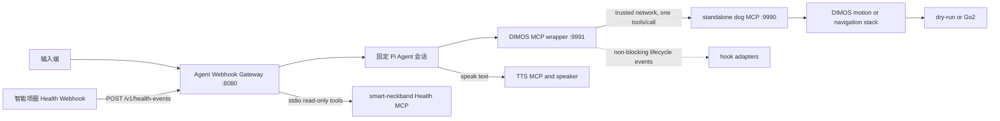

# 项目 Context

## 项目范围

本仓库是以 Pi 为基础的组合仓库。自研机器人能力统一放在 `components/`，并拆分为两个可独立安装和部署的组件：机器狗侧 `components/dimos-mcp` 与上层 `components/agent-framework`。当前硬件探索目标是使用 [DIMOS](https://github.com/dimensionalOS/dimos) 将 Agent 的 MCP 工具调用连接到机器狗。

`packages/` 保留 Pi 上游包的原有布局，作为 Agent Framework 使用的基础依赖，不属于第三个机器人部署组件。组件之间只能通过公开协议连接，不得通过相对路径导入彼此的内部代码。

根 `CONTEXT.md` 是该仓库的单一领域 context。变更机器人、MCP 或 Agent 集成前，应先阅读本文件；如存在相关 `docs/adr/` 决策，也必须一并阅读。

## 对外使用文档

根 [USAGE.md](USAGE.md) 是框架使用者的公开使用与开发指南，覆盖上层 MCP Host 接入、下层机器狗接入、配置、hook 和扩展流程。

每次新增、删除或改变用户可见功能时，必须同步更新 `USAGE.md`。工具、参数、端点、环境变量、硬件适配方式、hook 契约和运行前置条件均属于用户可见功能；若变更还影响本文件中的术语、架构边界或安全不变量，也必须同时更新 `CONTEXT.md`。

## 组件与术语

| 名称 | 位置 | 职责 |
| --- | --- | --- |
| 机器人组件目录 | `components/` | 组合仓库中两个可独立部署组件的唯一根目录。 |
| 独立底层机器狗 MCP | `components/dimos-mcp` | 部署在机器狗侧主机的独立 DIMOS MCP，公开锁定版 DiMOS `0.0.14b1` 的 14 个非停止官方工具，以及 7 个自研工具；Go2 模式组合官方空间、导航与机器人技能，并在官方模块全部启动后显式启用固件 joystick 输入，但不嵌入模型、Agent 循环、云端 TTS 或人员跟随。 |
| Agent Framework | `components/agent-framework` | 部署在上层机器，组合固定 Pi Agent 会话、MCP 包装器、输入网关与可选 TTS MCP 工具。 |
| MCP 薄包装器 | `components/agent-framework/dimos-mcp-wrapper` | 独立 DIMOS MCP 服务，转发同名工具到上游 MCP，并发出生命周期 hook。 |
| 上游 MCP | 默认 `http://127.0.0.1:9990/mcp` | 真正执行机器狗命令的服务。 |
| 包装器 MCP | 默认 `http://127.0.0.1:9991/mcp` | MCP Host 应连接的服务。 |
| 生命周期 hook | `McpCallHook` | 对转发事件做最佳努力处理的旁路；不是权限检查器，也不是命令改写器。 |
| 外部指令事件 | 输入端契约 | 带稳定 `instruction_id` 的已确认用户请求文本；重试时 ID 不变，在投递前不等同于 Agent 会话消息。避免称其为 MCP 调用或机器狗命令。 |
| 语音停止口令 | 输入网关快速路径 | 规范化后精确等于“停”或“stop”的外部指令事件。它绕过 Agent 会话并触发 `stop_all`，但不等同于独立物理急停。 |
| 估算距离运动 | Agent 运动语义 | 用户以距离或距离加时长表达的运动请求。方向可选且默认向前；Agent 将其换算为经部署标定的有限时长速度指令。它是距离估算，不是定位或到达保证。 |
| 输入网关 | `components/agent-framework/agent-webhook-gateway` | 外部指令事件进入 Agent 前的唯一受理边界。避免称其为 MCP Server 或机器狗控制器。 |
| Agent 会话 | 部署内运行时 | 当前 MVP 中一个部署唯一且固定的 Agent 上下文；外部调用方不能指定或切换它。避免称其为外部会话路由。 |
| TTS MCP | `AGENT_WEBHOOK_TTS_MCP_URL` | 可选的独立无状态 HTTP JSON-RPC `tools/call` endpoint。配置后，固定 Agent 获得 `speak(text)` 工具并主动决定需要播报的完整用户可见文本；它不属于机器狗 MCP 工具契约，也不执行标准 MCP session 协商。 |
| Agent 最终文本 | Agent 内部回合结果 | 只用于结束当前内部回合，不会自动通过 Webhook 或其他传输发送给用户。需要播报时必须显式调用 TTS MCP。 |
| 健康通知 | 独立输入端契约 | 智能项圈发送的、带稳定 `notification_id` 和 event revision 的无鉴权唤醒通知；它不是权威健康状态，也不是自然语言指令。 |
| Health Webhook 接收器 | `components/agent-framework/agent-webhook-gateway` | 在独立 health 表和队列中校验 schema、原子去重并持久化 `/v1/health-events`，ACK 后查询上游只读 Health MCP。 |
| 上游 Health MCP | 配置的 stdio 子进程 | `smart-neckband` 仓库实现的权威健康工程状态读取边界；本仓库不生产 ECG/IMU 状态或健康事件。 |

## 不变量

1. 机器狗动作的参数验证、并发控制、零速度结束、dry-run/Go2 选择，以及 Go2 地图、规划、探索、巡逻和散步实现属于上游机器狗 MCP；包装器不得复制或绕过这些逻辑。
2. 每个包装器工具调用最多向上游发送一次 `tools/call` 请求。不得自动重试运动命令。
3. 包装器必须原样转发已公开工具的名称和参数，并返回上游的文本结果或清晰的上游错误。底层预期错误使用 `{"status":"error","error":"..."}` 文本 envelope；包装器和 Agent 网关还必须识别 DIMOS 将异常包装成的 `Error running tool '...'` 文本，不能把它当作成功。
4. `stop_all` 优先于 hook：请求必须立刻转发，hook 不能让它等待、重试或被吞掉。包装器只转发一次；探索、巡逻、散步、持续视觉查找、导航和定时速度的停止编排属于底层。
5. hook 事件为 `before_call`、`after_success`、`after_error`、`finally`。事件按 FIFO 入队，但 hook 不在 MCP 调用路径上执行，因此 `before_call` 不是前置拦截器。
6. hook 失败只能记录日志，不能改变上游请求、返回值或错误。hook 的投递是最佳努力，不保证在包装器进程退出时完成。
7. 当前没有确定“发送其他指令”的协议。不得先行增加假设性的 `send_instruction` MCP 工具、网络协议或硬件 SDK；确定协议后，以具体 hook/适配器接入。
8. 输入网关仅在外部指令事件持久化后返回 `202 Accepted`；该确认不表示 Agent 已处理、模型已响应或任何机器狗动作已执行。
9. 网关不得提供出站回复 Webhook、回复 outbox 或自动最终文本投递。需要向用户播报时，只能由模型显式调用独立 TTS MCP 的 `speak(text)`。
10. `speak` 每次只携带完整、直接面向用户的文本，不得包含内部执行细节、工具调用、推理或异常堆栈。Agent 最终 assistant 文本仅结束内部回合，不得绕过 `speak` 自动发送。
11. 当前 MVP 每个部署只有一个固定 Agent 会话；输入网关不得接受或信任外部传入的 Agent 或会话路由标识。
12. 当前 instruction Webhook、独立 TTS MCP 和 Health Webhook 均不提供身份校验、签名或重放防护；它们只能被视为受信任环境内的黑客松临时集成边界，不得被描述为安全的公网接口。非 loopback 部署必须使用受信任网络、主机防火墙和 TLS 终止限制访问。
13. 除语音停止口令外，输入网关只承载异步的自然语言事件，不能作为实时控制或紧急停止路径；语音停止口令也不能替代独立、直接的物理安全路径。
14. 固定 Agent 会话的普通外部指令事件按持久化受理顺序串行处理；一个事件达到终态后才开始下一事件。
15. Agent 无法完成回合时，网关只记录脱敏错误并将输入标记为完成；不得自动生成回退语、调用 TTS 或对外发送部分模型文本。
16. 语音停止口令在持久化与幂等登记后必须绕过 Agent 会话队列，经包装器单次调用 `stop_all`；任何不精确匹配的文本不得进入该快速路径。
17. 语音停止口令快速路径不经过 Agent，因此无论 `stop_all` 成功或失败都不得自动调用 TTS；调用结果只记录在运行日志中，也不得据此声称机器狗已物理静止。
18. 输入网关信任输入端已将每个 Webhook 确认为完整真实请求；它不采集音频、不做 ASR、唤醒、分段或用户意图判断，并将 `text` 作为不透明文本处理。
19. 可执行的运动请求必须为“速度加时长”“距离加时长”或仅“距离”；方向可选且默认向前。时长或速度脱离其配对参数均不完整。其他可能导致机器狗运动但必要参数不明确的请求，Agent 必须以面向用户的最终文本追问，且不得调用运动工具、套用默认参数或猜测用户意图。
20. 距离加时长的请求必须将距离除以时长换算为正的有限速度；仅距离的请求必须基于部署标定的默认速度换算为正的有限时长。面向用户的 `speak` 文本不得声称机器狗精确移动或到达了该距离。
21. 网关进程恢复时，不得重新运行已进入 `processing` 的事件；应直接将其标记为完成，不得重复 Agent、机器狗工具或 TTS 副作用。
22. 底层与包装器的公开工具集合固定为 21 个：DiMOS `0.0.14b1` 的 `server_status`、`list_modules`、`agent_send`、`relative_move`、`wait`、`current_time`、`execute_sport_command`、`get_battery_soc`、`observe`、`tag_location`、`navigate_with_text`、`begin_exploration`、`start_patrol`、`look_out_for`，以及本项目的 `move_forward`、`move_backward`、`stop_all`、`motion_status`、`return_to_start`、`return_to_user_and_greet`、`start_stroll`。官方 `speak`、人员跟随和各专项停止工具均不属于该公开契约，也不得被包装器注册。固定 Agent 只可在配置独立 TTS MCP 后额外注册本项目的 `speak(text)`，不得把它转发到机器狗 MCP。升级 DiMOS 时必须重新审计并同步该版本化契约，不能声称自动兼容未来新增工具。
23. 14 个受支持的官方工具在 Go2 模式中必须由 DiMOS 官方模块或官方 `McpServer` 实现。dry-run 除本地管理工具外只能返回明确的 `required_mode=go2` 错误，不得伪造遥测、感知、定位、路径、探索、巡逻或动作成功。
24. 定点导航、返航、Frontier 覆盖探索、已建图巡逻和人类式散步是不同生命周期。`return_to_start` 使用下层进程启动后捕获的第一帧有效里程计作为会话起点，距离起点不超过 0.20 米时不得向规划器提交目标；公开提前终止入口统一为 `stop_all`。底层必须保留专项停止能力供它内部编排，并在某一项失败后继续尝试其余停止动作，最后尝试本地零速度；任何专项停止方法都不得出现在公开 `tools/list`。
25. `start_patrol` 只在已经建图的区域按官方覆盖路由持续巡视。`start_stroll` 使用官方 Frontier 检测与导航，但在每个局部未知分支决策点随机选择一条、退休同一决策点的其他分支、拒绝回头补覆盖；无顺向候选时结束。该策略有意遗漏可探索区域，不得描述为巡逻或完整探索。
26. 底层 Go2 Blueprint 不得组合官方 `McpClient` 或任何 LLM Agent。官方 `PerceiveLoopSkill` 所需的 `AgentSpec` 由无模型的 `StandaloneAgentBridge` 提供：无 `then` 的视觉命中继续通过 MCP 工具流通知上层；带 `then` 的命中只允许经底层本机公开 MCP 端点调用一个公开工具。该桥接器不是对话 Agent，也不拥有用户会话。
27. Go2 实机入口必须等待 `ModuleCoordinator.build()` 完成官方模块启动，再通过锁定版 `GO2Connection.publish_request` 向官方 Sport endpoint 发送 `SwitchJoystick`（API `1027`，`data=true`），显式启用 `cmd_vel` 使用的固件输入。响应状态码不为 `0`、响应结构无效或调用抛出异常时，必须停止 coordinator 并让进程启动失败；不得进入服务主循环或声称 MCP 已就绪。状态码成功不是独立的底盘运动证明，dry-run 不执行该调用。
28. Health Webhook 必须使用独立 `/v1/health-events`、表、去重命名空间、durable queue 和 worker；不得复用 `/v1/instructions`、普通 Agent FIFO 或 TTS MCP。
29. Health Webhook body 只作为唤醒通知。ACK 只表示通知已通过 HTTP/schema 校验、按 raw-body digest 原子持久化和入队；处理方必须再查询 `health.get_event_details` 与 `health.get_current_state`。
30. Health 消费方在固定代码中要求 contract `0.2.0`、event revision 不回退、wearer/source 一致、`data_source=live`、`test_mode=false` 和 `freshness=fresh`。任何失败都不得使用旧生理值或交给 LLM 绕过。
31. v0.2 Health 事件不得调用 Agent、DimOS 或机器狗工具。`verified_no_action` 只表示权威状态检查与审计完成，不表示健康正常、医学安全或任何物理动作完成。
32. 固定 Agent 的系统提示词必须拒绝 `Bound` 以及所有空翻请求，不得调用 `execute_sport_command` 或其他运动工具，也不得改写为替代动作。该限制只约束固定 Agent，不改变 21 工具 MCP 契约，也不是程序级安全门；直接 MCP Host 不受该提示词约束。
33. `return_to_user_and_greet` 只使用预先由 `tag_location` 保存且实际名称精确为“用户身边”的固定地图点，不执行实时人员识别或跟随。底层必须等待导航进入成功终态，随后保持至少 1 秒静止窗口，再调用官方 Unitree `Hello` 动作；缺少精确标点、导航拒绝/取消/失败/超时或问候失败时必须返回错误，且不得提前问候或声称完成。

## 运行约束

- DIMOS `0.0.14b1` 要求 Python 3.10 至 3.12；本开发机的 Python 3.14 只能运行不依赖 DIMOS 的纯单元测试。
- 默认 MCP 安装 `dimos[web]==0.0.14b1` 以及 DIMOS 技能 schema 生成实际需要的 `langchain-core==1.5.0`；Go2 extra 安装 `dimos[cuda,unitree]==0.0.14b1`，并将 ONNX Runtime CPU/GPU 固定为 CUDA 12 对应的 `1.26.0`。CPU/GPU wheel 提供同名 Python 包，环境安装必须以 GPU wheel 覆盖收尾。真机启动脚本在连接 Go2 前把虚拟环境 NVIDIA wheel 的动态库加入当前进程并验证 `CUDAExecutionProvider`，避免安装顺序或 CUDA 版本漂移在硬件连接后才使感知 worker 崩溃。本项目只组合无需云端 TTS 或阿里云人员跟随凭据的运动、感知、地图与导航能力。
- 上游机器狗 MCP 默认 dry-run。实机 Go2 操作仍需显式设置上游的 `DIMOS_DOG_MCP_MODE=go2`，并满足场地隔离、独立急停和官方网络预检。
- Go2 入口在官方 `StandUp` / `BalanceStand` 初始化完成后显式执行一次 `SwitchJoystick` Sport 请求。该调用不增加 MCP 工具或环境变量；响应状态码不为 `0`、响应结构无效或调用抛出异常会终止启动，避免导航正常规划但底盘静默忽略 `WIRELESS_CONTROLLER` 速度帧。
- 独立底层 MCP 默认只监听 `127.0.0.1:9990`。跨机器调用时必须显式设置 `DIMOS_DOG_MCP_HOST=0.0.0.0` 或指定 interface 地址，并通过受信任网络和主机防火墙限制访问。
- 包装器默认请求超时为 120 秒，配置通过 `DIMOS_MCP_WRAPPER_*` 环境变量提供，以覆盖同步等待导航终态的组合工具。它不直接打开硬件连接。
- Agent Webhook Gateway 要求 Node.js 22.19 或更高版本，使用 Node 原生 SQLite 持久化 instruction inbox，并读取既有 Pi Agent 模型与认证配置；普通机器狗 MCP 调用默认超时为 120 秒，TTS MCP 默认超时为 10 秒。
- Health 消费端默认关闭。配置 wearer 后，Gateway 启用无鉴权的 `/v1/health-events`，并按配置用 stdio 启动上游 Health MCP；不配置时不会打开健康入口或子进程。

## 测试 seam

- 上游 MCP seam：标准 JSON-RPC `tools/call` 请求、21 个公开工具的单次调用、文本结果与错误传递。
- hook seam：hook 非阻塞、只读、异常隔离。
- DIMOS MCP seam：在兼容环境中，底层 `tools/list` 精确发现 14 个受支持的锁定版官方工具和 7 个自研工具，且不包含 `speak`、人员跟随或专项停止工具；Go2 Blueprint 不组合 `PersonFollowSkillContainer`，dry-run 的硬件能力返回明确的 Go2 模式错误。
- 回到用户并问候 seam：`return_to_user_and_greet` 只接受实际名称精确为“用户身边”的标点，确认导航成功后才等待至少 1 秒并执行 `Hello`；任何前置步骤失败都不得执行问候。
- Go2 Blueprint seam：静态组合中必须存在且仅存在一个满足 `AgentSpec` 的 `StandaloneAgentBridge`，避免 `PerceiveLoopSkill` 因缺少依赖而在连接硬件后启动失败。
- Go2 locomotion seam：官方模块完成启动后，入口必须对已部署的唯一 `GO2Connection` 通过 `publish_request` 发送一次 API `1027` / `data=true`；响应状态码不为 `0`、响应结构无效或抛出异常必须使启动失败。
- 输入 Webhook seam：严格请求 schema、持久化后 `202`、稳定 `instruction_id` 幂等与冲突响应。
- 固定 Agent seam：普通事件按持久化顺序串行处理，系统提示词明确最终 assistant 文本只结束内部回合并拒绝 `Bound` 与所有空翻请求，21 个包装器 MCP 工具保持激活。
- TTS MCP seam：未配置时不注册 `speak`；配置后只向独立端点发送 `speak(text)`，调用失败不自动重试，进程恢复不重复播报。
- 停止快速路径 seam：只匹配规范化后的“停”或 `stop`，绕过 Agent 并单次调用 `stop_all`；底层逐项停止并报告失败组件。
- Health Webhook seam：无鉴权请求、严格 HTTP/schema 验证顺序、并发原子去重、独立 durable queue、`202 accepted|duplicate` 与固定错误映射。
- Health MCP seam：stdio initialize、两个只读查询、TextContent/structuredContent 一致性，以及 live/test/freshness/revision 固定门；结果永不进入机器狗动作路径。

这些名称应直接用于后续的实现、测试、Issue 和设计讨论，避免将包装器误称为机器人控制器或将 hook 误称为同步拦截器。
