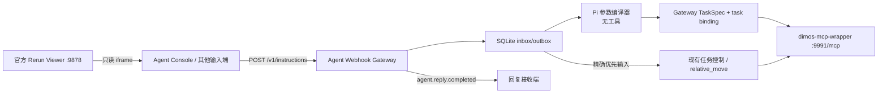

# Agent Webhook Gateway

该服务实现持久化输入网关、任务绑定和输出投递器。`product` 模式中的 Pi session
没有 MCP 或 coding tools，只把自然语言编译为四种严格参数：
`go_to_place`、`mark_place`、有限 `visit_route` 或 `follow_person`。
单地点和路线的每一段都复用既有 canonical `go_to_place` 任务；Gateway 生成稳定
task ID，持久化 `instruction_id -> task_id` 及路线进度，经
`dimos-mcp-wrapper` 提交并监听终态。标点读取已有 `get_robot_summary` 的 fresh
稳定坐标并写入现有 `SemanticWorld`；跟随请求直接启动 DimOS 官方
`follow_person`，不伪装成 canonical task。
精确的停止、暂停、继续、取消、状态和小步方向输入走同一个持久化优先队列，
不经过模型；方向输入只调用现有 `stop_all -> relative_move`。
Gateway 同源提供一个本地 Agent Console：左侧只读嵌入同一 DimOS Runtime 的官方
Rerun web viewer，右侧提交文字并读取已持久化的 instruction/task/reply 状态。
该页面不连接 Go2、不保存地图、不拥有任务状态，也不调用 MCP。
`validation` 模式保留不依赖模型 API 的确定性 Stage 1 Agent。product Pi session
显式使用可配置的 OpenAI-compatible provider；当前默认是 SiliconFlow
`zai-org/GLM-5.2`，不再继承用户 Pi 的当前模型。回复接收端只收到完整终态文本。



## 安装

需要 Node.js 22.19 或更高版本。先确保 `dimos-dog-mcp` 和 `dimos-mcp-wrapper` 已按仓库根目录 `USAGE.md` 启动。

```powershell
Set-Location "C:/absolute/path/to/pi-hackason/components/agent-framework/agent-webhook-gateway"
npm ci --ignore-scripts
npm run build
```

服务使用 Pi Coding Agent 的既有模型与认证配置，默认读取 `~/.pi/agent`。部署前应先用 Pi 完成模型和认证配置。

## 配置与启动

复制模板并填写部署值：

```powershell
Copy-Item ".env.example" ".env"
notepad ".env"
npm run build
npm run start
```

`.env` 会被 Git 忽略。默认回复目标是 Gateway 自己的
`/v1/ui-replies`，因此本机 Agent Console 不再要求额外回复接收器；需要向外部设备
推送时再设置 `AGENT_WEBHOOK_REPLY_URL`。远程联调时还应将
`AGENT_WEBHOOK_MCP_URL` 指向远程 `dimos-mcp-wrapper` 的 `:9991/mcp`，不要直接
连接 `dimos-dog-mcp`。`npm run start:dev` 使用同一 `.env` 直接运行 TypeScript
入口，适合本地调试。

启动后只打开一个前台：

```text
http://127.0.0.1:8080/
```

页面左侧默认读取 `http://127.0.0.1:9878/`。Product Runtime 必须设置
`VIEWER=rerun`、`RERUN_OPEN=none`、`RERUN_WEB=true`；这样只启动同一个
RerunBridge 的 web viewer 服务，不会自动再开浏览器标签页或第二个机器人 Runtime。

默认输入端点为：

```text
POST http://127.0.0.1:8080/v1/instructions
```

| 环境变量 | 默认值 | 说明 |
| --- | --- | --- |
| `AGENT_WEBHOOK_REPLY_URL` | `http://127.0.0.1:<Gateway端口>/v1/ui-replies` | 可选外部回复回调；省略时由本地 Console 确认已持久化回复。 |
| `AGENT_WEBHOOK_MAP_URL` | `http://127.0.0.1:9878/` | 同一 Product Runtime 的官方只读 Rerun web viewer。 |
| `AGENT_WEBHOOK_HOST` | `127.0.0.1` | 输入网关监听地址。 |
| `AGENT_WEBHOOK_PORT` | `8080` | 输入网关监听端口。 |
| `AGENT_WEBHOOK_DATABASE_PATH` | `<cwd>/data/agent-webhook.sqlite` | 持久化 inbox/outbox 的 SQLite 文件。 |
| `AGENT_WEBHOOK_MCP_URL` | `http://127.0.0.1:9991/mcp` | `dimos-mcp-wrapper` 的 HTTP MCP URL。 |
| `AGENT_WEBHOOK_MCP_TIMEOUT_MS` | `120000` | 单次 MCP 请求超时；`start_task` 不会自动重试。 |
| `AGENT_WEBHOOK_TASK_POLL_INTERVAL_MS` | `500` | `get_task_status` 轮询间隔。 |
| `AGENT_WEBHOOK_TASK_TIMEOUT_MS` | `330000` | 等待任务终态的总时限。 |
| `AGENT_WEBHOOK_REPLY_TIMEOUT_MS` | `10000` | 单次回复回调超时。 |
| `AGENT_WEBHOOK_RETRY_BASE_MS` | `1000` | 回复回调失败后的重投等待时间。 |
| `AGENT_WEBHOOK_RETRY_MAX_MS` | `60000` | 回复重投等待时间的上限。 |
| `AGENT_WEBHOOK_AGENT_CWD` | 当前目录 | 固定 Agent 会话的工作目录。 |
| `AGENT_WEBHOOK_AGENT_DIR` | `~/.pi/agent` | Pi 模型、认证和设置目录。 |
| `AGENT_WEBHOOK_SESSION_DIR` | `<cwd>/data/agent-session` | 固定 Agent 会话的持久化目录。 |
| `AGENT_WEBHOOK_DEFAULT_SPEED_MPS` | `0.1` | 仅 Stage 1 validation Pi 运行时使用；product 参数编译器忽略。 |
| `AGENT_WEBHOOK_TOOL_PROFILE` | `product` | `product` 或 `validation`；必须与 Wrapper profile 一致。 |
| `AGENT_WEBHOOK_RUNTIME` | 按 profile | product 默认 `pi`；validation 默认 `validation`，也可显式设置。 |
| `AGENT_WEBHOOK_MODEL_PROVIDER` | `siliconflow` | product Pi session 使用的 provider ID。 |
| `AGENT_WEBHOOK_MODEL_ID` | `zai-org/GLM-5.2` | product Pi session 的文本模型；不用于 Stage 3 视觉验证。 |
| `AGENT_WEBHOOK_MODEL_BASE_URL` | `https://api.siliconflow.cn/v1` | OpenAI-compatible API 根 URL。 |
| `AGENT_WEBHOOK_MODEL_API_KEY` | macOS Keychain | 可选明文环境变量覆盖；不得写入仓库。 |

普通 instruction/reply MVP 没有身份校验、签名或重放防护，只能部署在受信任网络。

Console 的“停止当前任务”仍提交精确文本“停”，复用 Gateway 的持久化优先路径；
它不会从浏览器直接调用 MCP。`202 Accepted`、地图可见或按钮已点击均不代表真实
动作完成，最终状态来自 Gateway 持久化的 canonical task snapshot 和回复。

macOS 默认从专用 Keychain 条目读取模型密钥：

```bash
read -r -s siliconflow_key
security add-generic-password -U \
  -a siliconflow \
  -s agent-webhook-gateway-siliconflow \
  -w "$siliconflow_key"
unset siliconflow_key
```

模型 provider、ID 和 URL 由 Gateway 显式注入 Pi session；`ValidationUserTextAgent`
仍是无模型规则运行时。更换主模型不改变视觉 verifier，也不改变机器狗 MCP、
导航或任务状态机。

Stage 1 无模型启动示例：

```bash
export AGENT_WEBHOOK_TOOL_PROFILE=validation
export AGENT_WEBHOOK_RUNTIME=validation
export AGENT_WEBHOOK_MCP_URL=http://127.0.0.1:9991/mcp
node dist/cli.js
```

该验证 Agent 只接受不超过 1 米的前进、回到起点、状态/轨迹查询和停止。MCP 的
`accepted` 或 `Navigation goal reached` 文本不作为物理完成证据；必须检查
`get_robot_summary` 的 fresh odometry 和实际位移。

## 行为

- 输入 JSON 只能包含非空的 `instruction_id` 和 `text`。
- 新事件和相同文本的幂等重投返回 `202`；同一 ID 对应不同文本返回 `409`。
- product 普通事件按 SQLite 受理顺序进入无工具 Pi 参数编译器；只接受
  `go_to_place + destination`、`mark_place + name`、有限
  `visit_route + waypoints + repeat_count`，或无额外字段的 `follow_person`。
- `mark_place` 只在 odometry fresh，且所需重定位 ready 时，将当前稳定位姿经
  `confirm_semantic_place` 写入现有 `SemanticWorld`。它不调用官方
  `tag_location`，避免同时维护两份 Agent 地点真相。
- `visit_route` 先用 `list_semantic_places` 校验当前 map ID/version 和全部地点/
  别名，再按有限次数依次提交现有 `go_to_place`。每段都有确定性 task ID；只有
  当前段 completed 后才进入下一段。
- `follow_person` 固定请求“启动时画面中央的人”，只有官方返回
  `Starting to follow` 才回复已开始；它不创建 task binding，也没有 canonical
  terminal snapshot。
- Gateway 从 `instruction_id` 确定性生成 task ID；模型不能提供或覆盖 task ID、
  UTC 时间、priority 或任务状态。
- `start_task` accepted、queued、navigating 或 recovering 都不会产生完成回复。
  只有同一 task ID 进入 completed/failed/cancelled 且 `active=false` 后才创建
  outbox 事件。
- “停/停下来/停止/马上停/别动”或 `stop/stop now` 的全句规范化匹配绕过
  Agent，单次调用 `stop_all`；“别停”“停一下再前进”等复合或否定句不会误命中。
- “暂停/继续/取消任务”复用当前 task ID 调用现有 lifecycle tools；“状态”聚合
  `get_task_status`、`get_robot_summary` 和 `list_semantic_places`。
- “前进/往前走/向前移动”等六类前后左右与转向口语，在去除有限礼貌外壳后做
  全句锚定匹配，绕过模型，先 `stop_all`，再调用现有 `relative_move`。平移固定
  为 0.2 m，旋转固定为 15°；“往前走到门口”“不要往前走”“往前走 2 米”不会
  被当成小步动作。回复只表示工具调用结果，不替代 fresh odometry 证据。
- product 编译器没有低层运动、`navigate_with_text`、exploration、patrol 或 sport
  tools；地点任务不能绕过 `MissionExecutor`。只有上述确定性小步输入由 Gateway
  固定调用 `relative_move`，模型不能选择参数。另一个例外是明确的
  `follow_person`，它直接启动官方 DimOS 后台技能。Stage 1 validation profile
  仍只注册五个验收工具。
- `stop_all` 由底层统一尝试停止定时速度、定点导航、探索、巡逻、散步和官方人员跟随；Agent 和快速路径都不再调用专项停止工具。
- MCP 调用使用稳定错误分类区分 Wrapper/Runtime 不可用、超时、协议异常和 Runtime
  拒绝；前台显示脱敏后的可操作提示。超时只表示结果未知，明确要求先查状态且不要
  重复发送。其他未分类错误仍使用固定失败回复。
- outbox 先持久化再回调。回调失败只重投同一 `reply_id`，不会重跑 Agent 或 MCP 工具。
- 进程启动时，状态为 submitted/monitoring 的 binding 只恢复
  `get_task_status`；崩溃在首次提交前的 compiled binding 会用同一确定性 task ID
  恢复提交。路线只续跑当前段和剩余段，不重跑已完成段。没有 binding 的旧中断
  指令 fail-closed 为固定失败回复。

直接连接 maintenance MCP 的其他 Host 仍可能调用通用运动工具；product Gateway
的无工具编译器和 product Wrapper allowlist 不等同于底层维护面的全局权限系统。
本阶段只实现统一文本输入和协调，不接入戒指、眼镜、ASR 或真实机器狗。

普通 HTTP schema 见 `docs/agent-input-webhook-integration.md`。

## 开发

```powershell
npm test
npm run check
```

### 本地 dry-run 端到端演示

不安装 DIMOS、不配置模型认证且不连接真实机器狗时，可运行：

```powershell
npm run demo:dry-run
```

该命令保留 Stage 1 validation 回归：使用临时端口和临时 SQLite 数据库启动真实
网关核心，并在进程内替身化 validation Agent、Wrapper、底层 MCP 和回复接收端。
它提交一条定时前进指令，在 Agent 仍被阻塞时再提交 `STOP`，并自动断言：

- 两条指令都收到完整的 `agent.reply.completed` 回调，且停止回调先返回；
- `move_forward` 和 `stop_all` 在包装器及底层替身中各调用一次，参数原样转发；
- 停止口令绕过忙碌的 Agent，固定 Agent 只运行一次。

成功时进程输出 `dry-run e2e passed` 和调用摘要，随后删除临时数据库。`npm test` 会自动执行同一场景。

主要扩展边界：

- 新的用户文本运行时实现 `UserTextAgent`；
- 新的 product 任务编译器实现 `TaskParameterCompiler`，不得持有 MCP 工具；
- 新的 MCP 传输实现 `McpToolCaller`；
- 新的回复传输实现 `ReplyEventDelivery`；
- Webhook schema、稳定 ID、固定会话串行语义和 outbox 不得由适配器改变。
