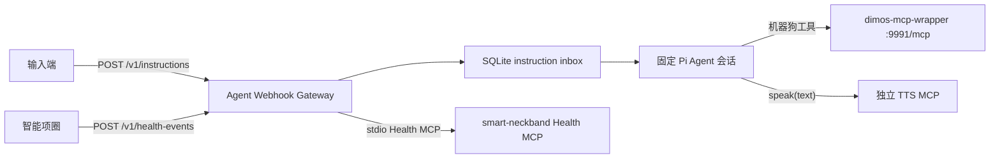

# Agent Webhook Gateway

该服务为固定 Pi Agent 会话提供持久化输入 Webhook，并可选注册独立 TTS MCP 的 `speak(text)` 工具。输入端只提交用户文本；Agent 通过 `dimos-mcp-wrapper` 使用机器狗工具，并在确实需要让用户听到内容时主动调用 TTS MCP。服务不包含出站回复 Webhook、回复 outbox 或自动 TTS 回调。

同一进程还可选承载智能项圈 Health MCP v0.2 的独立消费端。Health 通知使用无鉴权入口、独立表、队列和 stdio MCP client，不进入 Agent，也不触发物理动作。



## 安装

需要 Node.js 22.19 或更高版本。Linux arm64 使用 Node 官方 ARMv8 64-bit 构建，不需要在板端编译 SQLite。先确保 `dimos-dog-mcp` 和 `dimos-mcp-wrapper` 已按仓库根目录 `USAGE.md` 启动。

Windows PowerShell：

```powershell
Set-Location "C:/absolute/path/to/pi-hackason/components/agent-framework/agent-webhook-gateway"
npm ci --ignore-scripts
npm run build
```

服务默认读取 `~/.pi/agent` 中既有的 Pi Coding Agent 模型与认证配置。部署前应先用 Pi 完成模型和认证配置。

### Ubuntu 24.04 arm64（地瓜派）

使用 Node.js 22.19.0 或更高版本的官方 Linux ARM64 构建。systemd 单元只在 `/usr/local/bin`、`/usr/bin` 和 `/bin` 查找 Node；`command -v node` 必须返回其中之一。不要把 x64 Node、Windows `node_modules` 或本机已有 `dist` 复制到板上：

```bash
uname -m
node --version
node -p '`${process.platform}/${process.arch}`'
command -v node

cd "$HOME/pi-hackason/components/agent-framework/agent-webhook-gateway"
npm ci --ignore-scripts
npm run build
cp .env.example .env
npm run preflight:ubuntu-arm64
```

预检会检查 Ubuntu 24.04、arm64、Node 版本、原生 SQLite、构建产物、生产依赖、Pi 配置目录和持久化目录权限。如果配置了 TTS MCP URL，还会验证它是绝对 HTTP(S) URL；预检不会连接模型、DIMOS、TTS 或机器狗。

仓库提供 user-level systemd 单元，默认仓库位于 `$HOME/pi-hackason`：

```bash
mkdir -p "$HOME/.config/systemd/user"
cp deploy/ubuntu-arm64/agent-webhook-gateway.service "$HOME/.config/systemd/user/"
systemctl --user daemon-reload
systemctl --user enable --now agent-webhook-gateway.service
sudo loginctl enable-linger "$USER"
systemctl --user status agent-webhook-gateway.service
journalctl --user -u agent-webhook-gateway.service -f
```

服务应以部署用户运行；`.env`、`~/.pi/agent` 和 `data/` 只对该用户开放。

## 配置与启动

```powershell
Copy-Item ".env.example" ".env"
notepad ".env"
npm run build
npm run start
```

远程机器狗联调时，将 `AGENT_WEBHOOK_MCP_URL` 指向 `dimos-mcp-wrapper` 的 `:9991/mcp`，不要直接连接 `dimos-dog-mcp`。硬件需要 TTS 时，将 `AGENT_WEBHOOK_TTS_MCP_URL` 指向另一个实现 `speak(text)` 的端点；两个 URL 不得相同。当前传输是项目既有的无状态 HTTP JSON-RPC `tools/call` profile，不执行标准 MCP `initialize` 或 session 协商。`npm run start:dev` 使用同一 `.env` 直接运行 TypeScript 入口。

默认输入端点：

```text
POST http://127.0.0.1:8080/v1/instructions
```

| 环境变量 | 默认值 | 说明 |
| --- | --- | --- |
| `AGENT_WEBHOOK_HOST` | `127.0.0.1` | 输入网关监听地址。 |
| `AGENT_WEBHOOK_PORT` | `8080` | 输入网关监听端口。 |
| `AGENT_WEBHOOK_DATABASE_PATH` | `<cwd>/data/agent-webhook.sqlite` | instruction inbox SQLite 文件。 |
| `AGENT_WEBHOOK_MCP_URL` | `http://127.0.0.1:9991/mcp` | `dimos-mcp-wrapper` 的 HTTP MCP URL。 |
| `AGENT_WEBHOOK_MCP_TIMEOUT_MS` | `120000` | 单次机器狗 MCP 请求超时；运动工具不会自动重试。 |
| `AGENT_WEBHOOK_TTS_MCP_URL` | 未设置 | 独立 TTS tool-call endpoint；必须不同于机器人 MCP URL，设置后注册 `speak`。 |
| `AGENT_WEBHOOK_TTS_MCP_TIMEOUT_MS` | `10000` | 单次 TTS MCP 请求超时；失败不会自动重试。 |
| `AGENT_WEBHOOK_AGENT_CWD` | 当前目录 | 固定 Agent 会话的工作目录。 |
| `AGENT_WEBHOOK_AGENT_DIR` | `~/.pi/agent` | Pi 模型、认证和设置目录。 |
| `AGENT_WEBHOOK_SESSION_DIR` | `<cwd>/data/agent-session` | 固定 Agent 会话的持久化目录。 |
| `AGENT_WEBHOOK_DEFAULT_SPEED_MPS` | `0.1` | 用户只给距离时用于估算时长的部署标定速度。 |
| `AGENT_WEBHOOK_HEALTH_WEARER_ID` | 无 | 设置后启用 Health；单实例 wearer ID。 |
| `AGENT_WEBHOOK_HEALTH_MCP_COMMAND` | Windows: `py`；Linux: `python3` | 上游 stdio Health MCP 可执行文件。 |
| `AGENT_WEBHOOK_HEALTH_MCP_ARGS_JSON` | 平台相关 | 不经过 shell 的 `smart_neckband.health_mcp --transport stdio` 参数数组。 |
| `AGENT_WEBHOOK_HEALTH_MCP_TIMEOUT_MS` | `10000` | Health MCP initialize/tools call 超时。 |

输入 Webhook、TTS MCP 和可选 Health endpoint 都没有身份校验、签名或重放防护，只能部署在受信任网络。非 loopback 部署仍需 TLS、主机防火墙和网络访问控制。

### 终端日志

普通 instruction 生命周期使用单行结构化日志：

```text
[agent-webhook] 2026-07-25T11:00:00.000Z instruction.accepted {"instruction_id":"demo-1","kind":"agent","text":"你好"}
[agent-webhook] 2026-07-25T11:00:00.001Z instruction.processing {"instruction_id":"demo-1","kind":"agent"}
[agent-webhook] 2026-07-25T11:00:01.000Z instruction.completed {"instruction_id":"demo-1"}
```

非法请求记录 `request.rejected`，幂等重投记录 `instruction.duplicate`，模型或停止调用失败分别记录 `instruction.agent_failed`、`instruction.stop_failed`。没有任何 `reply.*` 日志。成功日志包含完整用户文本，因此终端输出属于敏感运行数据。

## 行为

- 输入 JSON 只能包含非空 `instruction_id` 和 `text`。
- 新事件和相同文本的幂等重投返回 `202`；同一 ID 对应不同文本返回 `409`。
- 普通事件按 SQLite 受理顺序串行进入一个固定 Agent 会话。
- “停”或 `stop` 的精确规范化匹配绕过 Agent，单次调用 `stop_all`，不会自动播报。
- 配置 TTS MCP 后，模型必须显式调用 `speak(text)` 才会产生用户可听内容。
- Agent 最终 assistant 文本只结束内部回合，不会自动发送。
- `speak` 成功只表示 TTS MCP 接受请求，不证明扬声器已播放；失败不会自动重试。
- Agent 或停止调用失败只记录日志并完成输入，不生成固定回退语。
- 进程启动时遗留的 `processing` 输入直接标记完成，不重跑 Agent、机器狗或 TTS。
- 固定 Agent 通过提示词拒绝 `Bound` 和所有空翻请求；这不是程序级安全门。
- Health 通知在独立 SQLite 表和 queue 中去重，验证通过时只记录 `verified_no_action`，不会调用 Agent 或机器狗 MCP。

完整输入和 TTS MCP 契约见 [接入指南](../../../docs/agent-input-webhook-integration.md)；Health 配置和错误映射见 [Health MCP 指南](../../../docs/health-mcp-consumer-integration.md)。

## 本地 dry-run 端到端演示

不安装 DIMOS、不配置模型认证且不连接真实机器狗时：

```powershell
npm run demo:dry-run
```

该命令使用临时端口和临时 SQLite，替代固定 Agent、`dimos-mcp-wrapper`、`dimos-dog-mcp` 和独立 TTS MCP。它断言：

- 普通输入只调用一次 `move_forward`；
- Agent 忙碌时，精确停止口令仍只调用一次 `stop_all`；
- 停止路径不会自动调用 TTS；
- Agent 恢复后主动调用一次 `speak`，文本原样到达 TTS MCP；
- 不存在回复 Webhook。

成功时输出 `dry-run e2e passed` 和调用摘要，随后删除临时数据库。

## Health MCP 跨仓库联调

准备好 `smart-neckband` Health 功能分支的 Python 3.12 虚拟环境后：

```powershell
$env:SMART_NECKBAND_HEALTH_ROOT = "C:/absolute/path/to/smart-neckband-health-worktree"
$env:SMART_NECKBAND_HEALTH_PYTHON = "$env:SMART_NECKBAND_HEALTH_ROOT/pc_app/.venv/Scripts/python.exe"
npm run demo:health-cross-repo
```

该命令使用临时上游 Health SQLite、临时 Gateway SQLite 和临时端口，运行真实的上游 Health store、Webhook sender、Pi Health receiver、durable queue 与上游 stdio MCP。上游 fixture 可附带旧签名 Header，但 Gateway 不读取它们。Agent、DIMOS 和 robot 调用计数必须均为 0。

## 扩展边界

- 用户文本运行时实现 `UserTextAgent`。
- 机器人 MCP 和 TTS MCP 传输均实现 `McpToolCaller`，但使用独立实例和 URL。
- `speak` 的名称与 `{ text: string }` 参数属于硬件 TTS MCP 接入契约。
- 输入 Webhook schema、稳定 ID、固定会话串行语义和停止快速路径不得由适配器改变。
