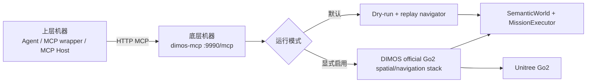

# 独立 DIMOS 机器狗 MCP

`dimos-mcp` 是部署在机器狗侧主机上的独立底层 MCP。它不依赖 Agent Webhook
Gateway 或 MCP 包装器运行。现在它也是产品唯一的 DimOS 组合入口：同一个 Runtime
只加载一个 Go2 连接、一个 navigator、一个持久化 `SemanticWorld`、一个
`MissionExecutor` 和一个 MCP Server。Go2 模式组合官方空间、导航、人员跟随和
机器人技能，但不运行第二个 Agent 循环或云端 TTS。



## 模块接口

服务通过显式工具 profile 区分自主产品面和人工维护面。默认 `product` 暴露
高层任务、官方地点导航、统一停止和只读状态工具；`maintenance` 才保留原有人工调试工具。
完整参数与语义表见根目录 `USAGE.md`：

| 工具 | 参数 | 行为 |
| --- | --- | --- |
| `start_task` | `task_json` | 提交严格任务契约；语义地点由同一 Runtime 的 `SemanticWorld` 解析。 |
| `get_task_status` | 无 | 查询活动或最近任务的真实执行状态。 |
| `pause_task` / `resume_task` | `task_id` | 暂停或恢复指定任务。 |
| `cancel_task` | `task_id` | 取消指定任务并等待 navigator 回到 idle。 |
| `list_semantic_places` | 无 | 列出当前 map ID/version 下已确认、可解析的地点。 |
| `confirm_semantic_place` | `place_json` | 仅保存操作者根据新鲜里程计确认的当前地点；不会自行识别或移动。 |
| `move_forward` | `speed_mps`、`duration_s` | 按给定速度和时长前进；实机动作结束时发布零速度。 |
| `move_backward` | `speed_mps`、`duration_s` | 按给定速度和时长后退；实机动作结束时发布零速度。 |
| `follow_person` | `query` | 官方 Qwen VL 初次定位人物，随后由 EdgeTAM + `VisualServoing2D` 本地持续跟随。 |
| `stop_all` | 无 | 先取消活动 mission，再统一停止探索、巡逻、散步、官方人员跟随、导航和本地定时速度，最后尝试发布零速度。 |
| `motion_status` | 无 | 返回本地命令执行状态，不是机器狗遥测。 |
| 17 个 DiMOS 官方工具 | 官方 `0.0.14b1` 签名 | 管理、相对移动、设备状态、导航、探索、巡逻、感知和人员跟随；不包含语音。 |
| `return_to_start` | 无 | 返回本次下层进程捕获的第一帧有效里程计位置。 |
| `return_to_user_and_greet` | 无 | 返回精确标记的“用户身边”，确认到达后静止 1 秒，再执行 `Hello`。 |
| `start_stroll` | 无 | 随机选择一个局部未知分支，退休其他分支并避免回头补覆盖。 |

速度和时长必须是正有限数值。当前不设置硬编码数值上限；dry-run 和 Go2 都使用同一运动状态机并拒绝重叠运动。可预期的参数或互斥错误返回 `{"status":"error","error":"..."}` 文本结果。MCP 请求返回只表示底层命令处理结果，不证明机器狗已经到达目标位置。

默认 `product` profile 精确暴露任务生命周期、官方 `tag_location`、
`navigate_with_text`、`stop_navigation`、`follow_person`、受控
`relative_move`、统一停止和只读工具，不暴露 `move_forward`、`move_backward`、
探索、巡逻或 sport action。
需要人工底层调试时必须显式设置
`DIMOS_DOG_MCP_TOOL_PROFILE=maintenance`。dry-run 使用同一 `SemanticWorld` 和
`MissionExecutor`，但 replay navigator 不发布真实硬件命令。

## 运行要求

- Python 3.10 至 3.12，推荐 Python 3.12。
- DIMOS 固定为 `0.0.14b1`。
- 基础安装固定使用 `dimos[web]==0.0.14b1` 和 `langchain-core==1.5.0`。后者是 DIMOS 生成 `@skill` 参数 schema 的实际运行依赖，并处于 DIMOS 声明的兼容范围内。
- 任务与语义地点模块来自同机安装的 `dimos-go2-studio==0.1.0`；本仓库开发时
  `uv` 使用相邻 DimOS checkout 的 editable source，部署包必须同时提供这个依赖。
- 真实 Unitree Go2 需要额外安装 `dimos[cuda,misc,perception,unitree]`、CUDA 12 对应的
  `onnxruntime==1.26.0` 与 `onnxruntime-gpu[cuda,cudnn]==1.26.0`。不能升级到
  ONNX Runtime 1.27；其 PyPI GPU wheel 已切换到 CUDA 13，与 DIMOS
  `0.0.14b1` 固定的 `cupy-cuda12x` 不兼容。
- Go2 模式在官方连接、站立和平衡初始化完成后，通过锁定版已有的 `GO2Connection.publish_request` 显式发送 `SwitchJoystick` Sport 请求；响应失败、结构无效或抛出异常时停止全部模块并让启动失败。
- 跨机器调用要求两台机器之间 TCP 网络可达。
- 当前 MCP 没有身份认证，只能暴露在受信任网络中。

## 在底层机器安装

当前开发版要求朋友仓库与 DimOS 仓库保持本机相邻布局，因为
`dimos-go2-studio` 通过 `tool.uv.sources` 指向
`../../../dimos/extensions/go2-studio-agent`。不需要复制朋友仓库中的 `packages/`
或整个 `components/agent-framework`，但不能只复制 `dimos-mcp` 一个文件夹后期待
语义任务层仍可安装。后续发布独立 wheel 时再移除这个本地路径约束。

POSIX：

```bash
cd /absolute/path/to/dimos-mcp
uv venv --python 3.12
source .venv/bin/activate
uv pip install -e .
```

PowerShell：

```powershell
Set-Location "C:/absolute/path/to/dimos-mcp"
uv venv --python 3.12
.\.venv\Scripts\Activate.ps1
uv pip install -e .
```

## 本机 dry-run

不设置运行模式时默认为 dry-run。默认只监听本机回环地址：

```bash
dimos-dog-mcp
```

默认 endpoint：

```text
http://127.0.0.1:9990/mcp
```

dry-run 不连接、站立或移动真实机器狗。默认 product profile 可运行语义任务 replay，
不会发布非零 `cmd_vel`。如需测试旧低层动作返回，显式切换 maintenance profile。

## 暴露给另一台机器

在底层机器显式监听所有 IPv4 interface：

POSIX：

```bash
export DIMOS_DOG_MCP_HOST=0.0.0.0
export DIMOS_DOG_MCP_PORT=9990
dimos-dog-mcp
```

PowerShell：

```powershell
$env:DIMOS_DOG_MCP_HOST = "0.0.0.0"
$env:DIMOS_DOG_MCP_PORT = "9990"
dimos-dog-mcp
```

`0.0.0.0` 只用于监听，不能写进上层调用 URL。假设底层机器局域网地址为 `192.168.66.160`，上层使用：

```text
http://192.168.66.160:9990/mcp
```

若主机防火墙阻止连接，只允许上层机器所在受信任网段访问 TCP 9990。不要对公网开放该端口。

Ubuntu UFW 示例：

```bash
sudo ufw allow from 192.168.66.0/24 to any port 9990 proto tcp
```

Windows 防火墙示例：

```powershell
New-NetFirewallRule `
    -DisplayName "DIMOS MCP trusted LAN" `
    -Direction Inbound `
    -Protocol TCP `
    -LocalPort 9990 `
    -RemoteAddress "192.168.66.0/24" `
    -Action Allow
```

防火墙规则应按实际上层 IP 或受信任网段收紧。

## 从上层机器验证

### 初始化

```bash
curl --request POST "http://192.168.66.160:9990/mcp" \
  --header "Content-Type: application/json" \
  --data '{"jsonrpc":"2.0","id":1,"method":"initialize","params":{"protocolVersion":"2025-11-25","capabilities":{},"clientInfo":{"name":"remote-check","version":"0.1.0"}}}'
```

### 发现工具

```bash
curl --request POST "http://192.168.66.160:9990/mcp" \
  --header "Content-Type: application/json" \
  --data '{"jsonrpc":"2.0","id":2,"method":"tools/list","params":{}}'
```

默认 `product` profile 返回的 `tools` 必须精确包含：

```text
stop_all
motion_status
get_robot_summary
server_status
list_modules
current_time
get_battery_soc
observe
follow_person
relative_move
tag_location
navigate_with_text
stop_navigation
start_task
pause_task
resume_task
cancel_task
get_task_status
list_semantic_places
confirm_semantic_place
```

`maintenance` profile 额外暴露锁定版 DiMOS `0.0.14b1` 的人工调试工具；升级
DiMOS 时必须重新审计该 allowlist。

### dry-run 前进调用

此例属于人工维护面，先设置
`DIMOS_DOG_MCP_TOOL_PROFILE=maintenance` 并重启服务；默认 product profile 会拒绝
发现或调用 `move_forward`。

```bash
curl --request POST "http://192.168.66.160:9990/mcp" \
  --header "Content-Type: application/json" \
  --data '{"jsonrpc":"2.0","id":3,"method":"tools/call","params":{"name":"move_forward","arguments":{"speed_mps":0.1,"duration_s":1.0}}}'
```

dry-run 工具文本包含：

```json
{
  "status": "dry_run",
  "direction": "forward",
  "linear_x_mps": 0.1,
  "duration_s": 1.0
}
```

### 查询状态

```bash
curl --request POST "http://192.168.66.160:9990/mcp" \
  --header "Content-Type: application/json" \
  --data '{"jsonrpc":"2.0","id":4,"method":"tools/call","params":{"name":"motion_status","arguments":{}}}'
```

## 上层接入方式

### 直接 MCP Host

支持 HTTP MCP 的 Host 可以直接连接底层 endpoint。例如：

```bash
claude mcp add --transport http --scope project dimos-dog http://192.168.66.160:9990/mcp
```

### 本机 Python GUI

`dimos-dog-gui` 是一个直接调用 HTTP MCP 的 Tkinter 图形控制台。它默认连接当前机器的 `http://127.0.0.1:9990/mcp`，可在界面内改为其他受信任的 HTTP(S) endpoint。GUI 提供前进、后退、全部停止、状态查询和连接检查按钮；前进/后退输入为速度（m/s）和持续时间（s），界面仅显示“速度 × 时间”的估算距离，不宣称机器狗精确到达该距离。

在支持图形界面的 WSL/Ubuntu 会话中启动：

```bash
dimos-dog-gui
```

Ubuntu 缺少 Tk 时先安装系统包 `python3-tk`。该 GUI 不保存 Go2 IP、AES 密钥或运行模式，也不直接连接硬件；每次按钮操作仅向已运行的 MCP endpoint 发送一次 JSON-RPC 请求，不会自动重试运动工具。

### WSL 真机启动脚本

`scripts/run-go2-mcp.sh` 只在 WSL/Ubuntu 中运行真实 Go2 MCP。它从 WSL 私有文件 `$HOME/.config/dimos-dog-mcp/go2.env` 读取 Go2 IP、AES 密钥和监听配置；该文件必须是权限 `600`，不应位于仓库或 Git 中。仓库提供无密钥模板 `config/go2.env.example`。

启动脚本会先把虚拟环境中由 ONNX Runtime optional dependencies 安装的 NVIDIA
动态库加入当前进程的 `LD_LIBRARY_PATH`，并验证
`CUDAExecutionProvider` 可用；预检失败时不会连接 Go2。预检通过后脚本进入 Go2
模式并执行 DIMOS Go2 连接的初始化流程；官方模块全部启动后，入口还会显式启用默认
`WIRELESS_CONTROLLER` 路径所需的 joystick 输入。只有官方调用返回成功后才打印 MCP
listening 消息并进入主循环；调用失败或抛出异常时进程停止 coordinator 并退出。保持
急停可用并让启动终端保持运行。GUI 在另一个 WSL 终端运行，默认连接同一 WSL 的
`127.0.0.1:9990`。

```bash
bash /absolute/path/to/dimos-mcp/scripts/run-go2-mcp.sh
```

### 通过本项目包装器

如果上层需要 `before_call`、`after_success`、`after_error` 和 `finally` hook，应在上层机器运行 `components/agent-framework/dimos-mcp-wrapper`：

```powershell
$env:DIMOS_MCP_WRAPPER_UPSTREAM_URL = "http://192.168.66.160:9990/mcp"
$env:DIMOS_MCP_WRAPPER_PORT = "9991"
dimos-mcp-wrapper
```

此时 Agent 或 MCP Host 连接上层机器的包装器：

```text
http://127.0.0.1:9991/mcp
```

底层 MCP 不需要知道包装器、Agent 或用户输入 Webhook 的地址。

## 配置

| 环境变量 | 默认值 | 说明 |
| --- | --- | --- |
| `DIMOS_DOG_MCP_HOST` | `127.0.0.1` | DIMOS MCP HTTP 监听地址。跨机器调用时设置为 `0.0.0.0` 或指定底层 interface 地址。 |
| `DIMOS_DOG_MCP_PORT` | `9990` | MCP TCP 端口，必须是 1 至 65535 的整数。 |
| `DIMOS_DOG_MCP_MODE` | `dry-run` | `dry-run` 或 `go2`。只有 `go2` 会连接真实硬件。 |
| `DIMOS_DOG_MCP_TOOL_PROFILE` | `product` | `product` 或 `maintenance`；默认只保留受控 `relative_move`，不暴露其他低层运动工具。 |
| `DIMOS_QWEN_VL_BASE_URL` | Alibaba 默认 | 官方人员跟随首次 bbox 使用的 OpenAI-compatible API 根 URL；SiliconFlow 使用 `https://api.siliconflow.cn/v1`。 |
| `DIMOS_QWEN_VL_MODEL` | `qwen2.5-vl-72b-instruct` | 官方人员跟随首次 bbox 的 provider model ID；当前部署使用 `Qwen/Qwen3-VL-8B-Instruct`。 |
| `DIMOS_QWEN_VL_API_KEY` | 无 | 官方人员跟随的 provider key；只能放私有环境文件或进程环境。 |
| `DIMOS_SEMANTIC_WORLD_PATH` | `~/.dimos/go2-studio/semantic-world.json` | 已确认语义地点的持久化 JSON。 |
| `DIMOS_MAP_ID` | dry-run 为 `replay-map` | 当前地图稳定 ID；Go2 模式必须显式设置。 |
| `DIMOS_MAP_VERSION` | dry-run 为 `replay-v1` | 当前地图版本；Go2 模式必须显式设置。 |
| `ROBOT_IP` | 无 | DIMOS Go2 连接使用的机器狗地址；只在 `go2` 模式中需要。 |

启动时配置非法会直接失败，不会回退到其他地址、端口或实机模式。

## 启用真实 Unitree Go2

完成场地隔离、独立急停、低延迟网络和 DIMOS/Unitree 网络预检后，在底层机器安装 Go2 extra：

```bash
cd /absolute/path/to/dimos-mcp
source .venv/bin/activate
uv pip install -e '.[go2]'
uv pip install --reinstall --no-deps 'onnxruntime-gpu==1.26.0'
```

CPU 与 GPU wheel 都提供同名的 `onnxruntime` Python 包，因此必须让 GPU wheel
最后安装；否则导入成功也可能只暴露 `CPUExecutionProvider`。启动脚本会在连接机器狗
之前验证 `CUDAExecutionProvider`，预检失败时直接退出。

然后显式启动：

```bash
export ROBOT_IP=<YOUR_GO2_IP>
export DIMOS_DOG_MCP_MODE=go2
export DIMOS_DOG_MCP_TOOL_PROFILE=product
export DIMOS_SEMANTIC_WORLD_PATH="$HOME/.dimos/go2-studio/semantic-world.json"
export DIMOS_MAP_ID=<CURRENT_MAP_ID>
export DIMOS_MAP_VERSION=<CURRENT_MAP_VERSION>
export DIMOS_PREMAP_FILE="$HOME/.dimos/go2-studio/<CURRENT_MAP>.pc2.lcm"
export DIMOS_QWEN_VL_BASE_URL=https://api.siliconflow.cn/v1
export DIMOS_QWEN_VL_MODEL=Qwen/Qwen3-VL-8B-Instruct
export DIMOS_QWEN_VL_API_KEY=<PRIVATE_KEY>
export DIMOS_DOG_MCP_HOST=0.0.0.0
export DIMOS_DOG_MCP_PORT=9990
dimos-dog-mcp
```

Stage 2 Go2 模式复用 DiMOS 官方轻量 `unitree_go2` Blueprint，并补回官方
`SpatialMemory(new_memory=false)`、`NavigationSkillContainer` 与一个
`PersonFollowSkillContainer`，继续组合地图、
规划、探索/巡逻、Unitree 设备技能和本项目的语义任务层。它不加载
`PerceiveLoopSkill` 或 `StandaloneAgentBridge`。官方地点集合会跨 Runtime 重启保留；
`tag_location`、`navigate_with_text`、`stop_navigation` 直接进入 product 工具面。
`ModuleCoordinator.build()` 完成所有官方模块启动后，
入口同步通过 `GO2Connection.publish_request` 向 `rt/api/sport/request` 发送 API
`1027` / `data=true`，避免导航已经产生 `cmd_vel`、但 Go2 固件静默忽略默认
`WIRELESS_CONTROLLER` 帧。响应状态码不为 `0`、结构无效或抛出异常时，进程停止
全部模块并失败退出。现有 canonical `SemanticWorld` / `MissionExecutor` 仍保留，
不会为简单地点导航再增加一套 Planner 或 Agent 框架。

官方人员跟随只在启动时调用 Qwen VL，随后由 EdgeTAM 在本地以 20Hz 跟踪并由
`VisualServoing2D` 直接发布速度。它明确假设路径清空，不经过 A*、不做障碍物
避让、不自动重识别丢失目标，也不产生 canonical task 终态。product 只公开
`follow_person`，停止统一调用 `stop_all`；官方 `stop_following` 仅保留在
maintenance 工具面。

Stage 2 还要求 `DIMOS_PREMAP_FILE` 指向一份已存在的 `.pc2.lcm` 预建图。
Runtime 加载官方 `RelocalizationModule`，把已确认地点持久化在稳定 `map` 帧；
每次导航前再转换到当前会话的 `world` 帧。没有有效 `world -> map` 变换时，
确认地点与地点解析均 fail-closed，不能把旧会话的里程计坐标直接当作可复用地点。

Go2 的局域网信令必须绕过 HTTP 代理。Python 会读取 macOS 系统代理，即使终端没有
显式 `HTTP_PROXY`；启动入口会把 `ROBOT_IP` 同时加入 `NO_PROXY` 和 `no_proxy`。
当前固件若 `/con_notify` 返回 `data2=2`，不需要 `UNITREE_AES_128_KEY`；只有
`data2=3` 的握手才需要在私有环境文件中提供该密钥。

Stage 2 提供独立验收客户端，不把“任务 accepted”当成到达。先执行只读预检：

```bash
dimos-stage2-audit preflight \
  --place 测试起点 \
  --place 门口测试点
```

它要求唯一 Go2 product Runtime、PID 所有权一致、新鲜 odometry、已就绪的
`world -> map` 重定位、无活动 canonical task，以及当前 map/version 上唯一匹配的
语义地点。任何条件不满足都不会调用 `start_task`。

清场并获得本轮明确授权后，每次只运行一个单程：

```bash
dimos-stage2-audit trip \
  --destination 门口测试点 \
  --task-id task-stage2-normal-001 \
  --acknowledge-motion 'START GO2，场地已清空'
```

验收器不会重试运动工具；它轮询同一 task ID，记录终态、map/version、计划与真实
轨迹快照、最终稳定坐标和到达误差。超过时限只调用一次 `cancel_task`，并把
`navigation_idle` 写入证据。独立取消验收使用：

```bash
dimos-stage2-audit cancel-check \
  --destination 门口测试点 \
  --task-id task-stage2-cancel-001 \
  --acknowledge-motion 'START GO2，场地已清空'
```

默认 JSON 证据写入 `~/.dimos/go2-stage2/evidence/`。该客户端只证明 MCP/机器人
侧事实；Agent、Gateway 和 Studio 是否显示相同 task ID 仍须在 S2-R1 中单独核对。

MCP 客户端断开不等同于取消；应显式调用统一的 `stop_all`。

非 Go2 设备应在底层包中替换或扩展 DIMOS 连接 module，使其消费同名、同类型的 `cmd_vel: Twist`，同时保留参数验证、运动互斥和零速度停止。

## 测试

纯运动状态机和配置测试不依赖 DIMOS：

```powershell
Set-Location "C:/absolute/path/to/dimos-mcp"
$env:PYTHONPATH = "$PWD/src"
python -m unittest discover -s tests -v
```

DIMOS 集成测试要求 Python 3.10 至 3.12 且已安装项目依赖。Python 3.13 及更高版本会跳过这些集成测试。

## 部署边界

- 一个底层 MCP 进程对应一个本地运动执行器。
- 不要同时运行多个进程控制同一台机器狗。
- 默认 dry-run 是安装安全默认值，不代表真实 Go2 链路已经验证。
- Go2 启动成功只证明 `SwitchJoystick` 请求返回状态码 `0`；最终实机验收仍须观察非零 `/cmd_vel` 对应的 `/odom` 变化。
- `motion_status` 是进程内命令状态，不是遥测。
- MCP 没有认证、授权、签名、速率限制或公网防护。
- 上层连接中断不会自动触发 `stop_all`。
- 上层不得自动重试运动工具；网络状态不确定时先查询状态或停止，再由用户决定下一步。
