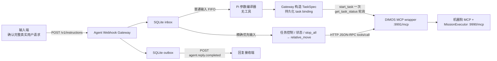

# Agent 输入与最终回复 Webhook 开发对接指南

> 文档版本：Stage 2 v0.3
>
> 实现位置：`components/agent-framework/agent-webhook-gateway`
>
> 当前状态：`go_to_place`、`mark_place`、有限 `visit_route`、任务控制、小步方向
> 输入及官方 `follow_person` 已在既有 Gateway 中实现并通过 fake-MCP 软件测试；
> 本次没有连接或移动 Go2。
>
> 适用对象：提交真实用户文本的输入端开发者、接收 Agent 最终回复的回复接收端开发者，以及负责部署和扩展网关的 Agent 侧开发者。

本文描述的是当前项目已经存在的实现，不是未来设计草案。产品模式允许标记当前
位置、前往已知语义地点、执行有限命名路线及启动官方人员跟随。模型仍没有工具；
精确任务控制和小步方向由 Gateway 固定调用既有工具。

开始开发前，还应阅读：

- 根目录 [CONTEXT.md](../CONTEXT.md)：系统边界、术语和不可违反的不变量。
- 根目录 [USAGE.md](../USAGE.md)：机器狗 MCP、MCP 包装器、hook 和完整部署方式。
- [ADR-0001](adr/0001-agent-webhook-inbox-outbox.md)：选择持久化 inbox/outbox Webhook 架构的原因。
- 网关目录 [README.md](../components/agent-framework/agent-webhook-gateway/README.md)：网关本身的安装、配置和开发入口。

## 1. 交付范围

### 1.1 当前已经实现

当前网关已经实现以下能力：

1. 通过 `POST /v1/instructions` 接收带稳定 `instruction_id` 的用户文本。
2. 使用 Node.js 原生 SQLite 将输入先写入 inbox，再返回 `202 Accepted`。
3. 对相同 `instruction_id` 和相同 `text` 的重投做幂等去重。
4. 拒绝相同 `instruction_id` 对应不同 `text` 的冲突请求。
5. 将普通输入按持久化受理顺序串行交给一个无工具的固定 Pi 参数编译会话。
6. 严格接受 `go_to_place`、`mark_place`、有限 `visit_route` 或
   `follow_person` 参数。单地点和每个路线段由 Gateway 生成完整 `TaskSpec`；
   跟随直接调用官方后台技能，不创建 task binding。
7. 将精确停止、暂停、继续、取消、状态和六个小步方向文本作为优先路径处理。
8. 将 `instruction_id -> task_id -> TaskSpec` 及有限路线进度持久化到 SQLite。
9. 单地点和每个路线段的确定性 task ID 最多提交一次，随后轮询
   `get_task_status`；路线只在上一段 completed 后进入下一段。
10. 只有同一任务进入终态并且 `active=false` 后，才生成最终用户回复。
11. 重启时对 submitted/monitoring binding 恢复状态监听；对尚未提交的 compiled
    binding 使用同一 task ID 恢复提交；路线不重跑已完成段。
12. 将终态回复或固定失败文本持久化到 outbox。
13. 通过部署级回复 Webhook 发送完整的最终用户可见文本。
14. 对回复回调失败进行持久化重试，不重新编译任务或重复 MCP 调用。

### 1.2 当前没有实现

以下能力不属于普通 instruction/reply MVP v0.1，接入方不得假设其存在：

- 入站或出站 Webhook 身份认证。
- 请求签名、时间戳校验或重放防护。
- 用户、租户、Agent 或会话路由。
- 每条请求指定不同回调地址。
- 同步等待 Agent 结果的 HTTP 接口。
- 查询输入状态、查询回复、取消输入或人工重放回复的管理接口。
- 健康检查或 readiness HTTP 端点。
- WebSocket、SSE 或 token 流式输出。
- 回复投递最大重试次数、死信队列或自动过期清理。
- 多个网关实例共享同一数据库和会话目录的高可用协调机制。
- 无限循环路线、任意任务图或用户自定义 MissionKind。
- 自然语言自由低层运动、探索、巡逻、运动表演或任意工具选择。只有精确六方向
  固定为 0.2 m / 15° 小步。
- 对模型最终文本进行内容过滤、敏感信息清洗或二次审核。
- 独立物理急停。
- 在 Gateway 内部直接判断里程计到达；到达证据由下游 `MissionExecutor` 返回并校验。

## 2. 保证层级

为了避免把“提示模型这样做”误认为“代码一定会这样做”，当前能力分为三层。

| 层级 | 含义 | 当前示例 |
| --- | --- | --- |
| 程序级保证 | 由 HTTP 校验、SQLite 状态、队列或固定代码路径强制执行。 | 严格输入、稳定 task ID、有限路线进度、终态且 inactive 才回复、优先控制、outbox 重投。 |
| 模型参数编译 | 模型只把自然语言缩减为受限参数；没有任何工具权限。 | 输出 `go_to_place`、`mark_place`、有限 `visit_route` 或 `follow_person`；其输出由严格 JSON/schema 校验。 |
| 部署和联调责任 | 依赖目标环境、模型配置、网络、MCP 服务和回复接收端共同满足。 | 模型可用、语义地点已建、包装器可访问、真实导航完成、回调 URL 可达。 |

因此：

- 本文写明“网关拒绝”“网关只调用一次”“网关持久化”等内容时，表示程序级行为。
- 模型输出错误、额外字段、未知任务类型或空地点时，网关 fail-closed，不会提交任务。
- 模型不能指定 task ID、时间、优先级、任务状态或 MCP 工具。

## 3. 系统边界与数据流



组件职责如下：

| 组件 | 当前职责 | 不负责 |
| --- | --- | --- |
| 输入端 | 麦克风、唤醒、ASR、分段、确认一次完整真实请求、生成并持久化 `instruction_id`、提交和重试。 | 不直接调用 MCP，不指定 Agent 会话，不解释 `202` 为动作成功。 |
| Agent Webhook Gateway | HTTP 校验、inbox/outbox、幂等、无工具参数编译、TaskSpec、有限路线、优先控制、终态监听和回复重投。 | 不采集音频，不提供认证，不拥有地图/导航，不提供物理急停。 |
| Pi 参数编译器 | 只把用户文本编译为四种严格参数。 | 不持有 MCP/coding 工具，不生成 task ID/位移参数，不判断任务完成。 |
| MCP 包装器 | 产品模式转发 20 个任务、地点、受控相对位移、状态、停止和只读工具，并执行旁路生命周期 hook。 | 不接收用户自然语言，不重复任务提交，不承担回复投递。 |
| 机器狗 MCP | 持有唯一 `MissionExecutor`、`SemanticWorld`、导航器和 Go2 连接；解析语义地点并执行任务状态机。 | 不生成用户回复，不接收 `instruction_id`。 |
| 回复接收端 | 持久化并按 `reply_id` 去重，向最终用户显示或通过 TTS 朗读 `text`。 | 不期待模型 token、工具结果、内部错误或独立失败事件。 |

## 4. 输入端 HTTP 契约

### 4.1 Endpoint

当前普通指令域只接受以下方法和精确路径：

```http
POST /v1/instructions
Content-Type: application/json; charset=utf-8
```

默认完整 URL：

```text
http://127.0.0.1:8080/v1/instructions
```

部署方可以通过环境变量修改监听地址和端口。输入端必须使用部署方提供的实际 URL。

注意：

- 路径必须精确等于 `/v1/instructions`。
- 当前实现不接受路径末尾 `/` 或 query string。
- 其他 HTTP 方法或路径返回 `404`。
- `Content-Type` 必须以 `application/json` 开头；接入方应始终发送标准的 `application/json; charset=utf-8`。
- 整个 HTTP 请求体最多为 65,536 字节，即 64 KiB。该上限包含 JSON 字段名、引号和其他 JSON 开销，不是单独的 `text` 字段上限。
- 超过 64 KiB 的请求返回 `400 Bad Request`。

### 4.2 请求体

请求体必须是 JSON object，并且只能包含 `instruction_id` 和 `text` 两个字段：

```json
{
  "instruction_id": "6cfbbfbc-7ec5-4c47-a326-b3e2d563a43d",
  "text": "请去演示点"
}
```

| 字段 | 类型 | 必填 | 当前校验 |
| --- | --- | --- | --- |
| `instruction_id` | string | 是 | 去除首尾空白后必须非空。当前不强制 UUID/ULID 格式，也没有独立长度限制，但整个请求受 64 KiB 上限约束。 |
| `text` | string | 是 | 去除首尾空白后必须非空。服务保存并向 Agent 传递原始字符串，不会自动 trim、改写、翻译或结构化。 |

禁止发送第三个字段，包括但不限于：

- `agent_id`
- `session_id`
- `user_id`
- `reply_to`
- `callback_url`
- `tool`
- `arguments`
- `system_prompt`
- `metadata`

存在任何额外字段时，整个请求返回 `400`。

### 4.3 `instruction_id` 生成和持久化

输入端必须为每个新的完整用户意图生成稳定且唯一的字符串 ID。推荐 UUID v4 或 ULID，但当前服务端只要求非空字符串。

输入端必须遵守以下规则：

1. 在首次发送 HTTP 请求前，先持久化 `instruction_id` 和原始 `text`。
2. 同一用户意图因超时、断网或 `503` 重试时，必须复用完全相同的 ID 和完全相同的文本。
3. 不要因为没有收到 HTTP 响应就生成新 ID；服务端可能已经持久化成功。
4. 新的用户意图必须生成新 ID。
5. 同一 ID 的文本比较是精确字符串比较。大小写、空白或标点变化都会被视为不同文本并返回 `409`。

例如，以下两个请求会冲突：

```json
{"instruction_id":"request-1","text":"向前走"}
```

```json
{"instruction_id":"request-1","text":"向前走。"}
```

### 4.4 正常受理响应

新事件完成 SQLite 持久化后返回：

```http
HTTP/1.1 202 Accepted
Content-Type: application/json; charset=utf-8
```

```json
{
  "instruction_id": "6cfbbfbc-7ec5-4c47-a326-b3e2d563a43d",
  "status": "accepted"
}
```

相同 `instruction_id` 和完全相同 `text` 的幂等重投也返回相同结构的 `202`。

`202` 只表示：

- 请求结构有效；
- 输入已经存在于 inbox 中；
- 网关将异步处理该输入，或该输入此前已经受理。

`202` 不表示：

- Agent 已经开始或完成处理；
- 模型已经生成回复；
- MCP 工具已被调用；
- MCP 包装器或机器狗 MCP 接受了命令；
- 机器狗已经移动或停止；
- 回复回调已经成功。

### 4.5 错误响应

当前错误响应如下：

| HTTP 状态 | 响应体 | 触发条件 | 输入端动作 |
| --- | --- | --- | --- |
| `400 Bad Request` | `{"error":"invalid_request"}` | Content-Type 不合法、JSON 无法解析、请求体超过 64 KiB、字段不是严格两个、字段类型错误或字符串为空。 | 修正请求。若它代表新的用户意图，使用新 ID；不要无修改无限重试。 |
| `404 Not Found` | `{"error":"not_found"}` | 方法或路径不等于 `POST /v1/instructions`。 | 修正 URL 或 HTTP 方法。 |
| `409 Conflict` | `{"error":"instruction_id_conflict"}` | 同一 ID 已经绑定不同的原始文本。 | 停止自动重试，排查 ID 生成、持久化或文本变更。 |
| `503 Service Unavailable` | `{"error":"persistence_unavailable"}` | 受理过程中出现未被归类的内部错误，包括持久化失败。 | 使用完全相同的 ID 和文本按输入端策略重试。 |

当前没有结构化错误详情、错误追踪 ID 或 `Retry-After` header。

### 4.6 推荐的输入端重试状态机

输入端至少持久化：

| 数据 | 用途 |
| --- | --- |
| `instruction_id` | 重试与最终回复关联键。 |
| 原始 `text` | 保证重试时文本逐字节保持一致。 |
| 当前提交状态 | 区分未发送、等待响应、已受理、冲突和已收到终态回复。 |
| 已处理的 `reply_id` | 对回复 Webhook 去重。 |

推荐处理原则：

1. `202`：标记为已受理，停止入站重试，等待回复回调。
2. 网络错误或请求超时：状态保持不确定，使用相同 ID 和文本重试。
3. `503`：使用相同 ID 和文本重试。
4. `400`：视为客户端契约错误，停止自动重试。
5. `404`：视为部署配置错误，停止自动重试。
6. `409`：视为 ID 冲突，停止自动重试并告警。

网关没有提供状态查询接口。如果输入端收到 `202` 后长期没有回调，只能由部署方检查网关、SQLite outbox、回调网络和日志，不能通过当前 API 查询状态。

## 5. 网关处理语义

### 5.1 持久化 Inbox

网关使用 Node.js 原生 SQLite，默认数据库文件为：

```text
<网关进程当前目录>/data/agent-webhook.sqlite
```

数据库启用：

- `PRAGMA journal_mode = WAL`
- `PRAGMA foreign_keys = ON`

输入表保存：

- 自增受理顺序 `sequence`
- 唯一 `instruction_id`
- 原始 `text`
- 是否为精确优先控制路径
- `pending`、`processing` 或 `completed` 状态
- UTC 接收时间

HTTP `202` 只会在 `acceptInstruction` 完成后发送。

### 5.2 普通输入队列

普通输入按照 SQLite `sequence` 顺序处理：

1. 从最早的 `pending` 普通输入中领取一条。
2. 将其状态改为 `processing`。
3. 将原始 `text` 交给固定 Pi 参数编译器。
4. 严格校验参数。标点读取现有稳定 pose；单地点和路线段由 Gateway 生成稳定
   task ID 和完整 `TaskSpec`。
5. 在任何下游提交前持久化 task binding；路线同时保存有限 waypoints、轮数和
   当前段索引。
6. 单地点或当前路线段调用一次 `start_task`。
7. 轮询 `get_task_status`；accepted、queued、navigating 等中间态不产生回复。
8. 路线段 completed 后才生成下一段不同 task ID；失败/取消立即结束整条路线。
9. 最终任务进入 completed/failed/cancelled 且 `active=false` 后生成固定回复。
10. 将回复写入 outbox，并将输入标记为 `completed`，再领取下一条普通输入。

因此，一个网关进程内同时只编译和监听一个普通任务。Gateway 不把“任务已受理”误报为“已经到达”。

这不表示回复 Webhook 必然按输入顺序成功到达。回调失败、重试和接收端网络状态可能改变实际到达顺序，回复端必须使用 ID 关联。

### 5.3 固定 Pi 参数编译会话

产品模式只创建一个 Pi 会话：

- 使用 `AGENT_WEBHOOK_AGENT_CWD` 作为 Agent 工作目录。
- 使用 `AGENT_WEBHOOK_AGENT_DIR` 读取 Pi 的模型、认证和设置。
- 使用 `AGENT_WEBHOOK_SESSION_DIR` 持久化会话。
- 启动时通过 `SessionManager.continueRecent` 继续该目录下最近的会话。
- 外部请求不能指定、切换或重置会话。

资源加载器明确关闭：

- Pi extensions
- skills
- prompt templates
- themes
- context files
- Pi 内建编码工具
- 所有 MCP 工具

当前模型只允许输出以下四种结构：

```json
{"kind":"go_to_place","destination":"演示点"}
{"kind":"mark_place","name":"演示点"}
{"kind":"visit_route","waypoints":["客厅","门口"],"repeat_count":2}
{"kind":"follow_person"}
```

地点标签经 NFKC、trim 和空白折叠后长度必须为 1–200。路线必须包含 2–20 个地点，
`repeat_count` 必须是 1–20 的整数，因此不能形成无限任务；`follow_person` 只能
包含 `kind`。人物描述、bbox、task ID、Markdown、解释文字、额外字段或未知任务
类型都会被拒绝。

Gateway 使用 `sha256(instruction_id)` 的前 32 个十六进制字符形成稳定 task ID，并固定填写 `priority="normal"`、UTC `created_at`、`target_description=null` 和 `question=null`。模型不能覆盖这些字段。

产品 Wrapper 精确开放 20 个工具：

- 任务：`start_task`、`pause_task`、`resume_task`、`cancel_task`、`get_task_status`
- 语义地点：`list_semantic_places`、`confirm_semantic_place`、`tag_location`、
  `navigate_with_text`、`stop_navigation`
- 官方人员跟随：`follow_person`
- 受控相对位移：`relative_move`
- 停止：`stop_all`
- 状态/只读：`motion_status`、`get_robot_summary`、`server_status`、`list_modules`、`current_time`、`get_battery_soc`、`observe`

Gateway 单地点和路线段只调用 `start_task/get_task_status`；标点调用
`get_robot_summary/confirm_semantic_place`；跟随只调用一次 `follow_person`。
精确任务控制使用 lifecycle tools，方向固定调用 `stop_all -> relative_move`。
Gateway 不因网络失败自动重试运动工具。若提交响应不确定，它先用稳定 task ID 查询
状态；只有明确仍处于本地 compiled、尚未提交的 binding 才在进程恢复时用同一 ID
提交。

### 5.4 最终回复提取

产品模式的用户回复由 Gateway 根据已校验终态确定性生成，而不是读取模型的自由文本：

| 下游终态 | 条件 | 用户回复 |
| --- | --- | --- |
| `completed` | 同一 task ID，`active=false`，且包含结果证据 | `任务已完成：已到达“<destination>”。` |
| 路线最终段 `completed` | 每一段都 completed，最终段 `active=false` | `路线任务已完成：<A → B>，共 <N> 轮。` |
| `cancelled` | 同一 task ID，`active=false` | `任务已取消：<terminal_reason>。` |
| `failed` | 同一 task ID，`active=false` | `任务未完成：<terminal_reason>。` |

标点被 `SemanticWorld` 接受后回复 `已将当前位置标记为“<name>”。`。暂停、继续、
取消、状态和方向回复同样由固定代码生成，模型不能撰写或改写。

如果编译、schema、MCP、状态一致性或超时检查失败，网关使用固定失败文本：

```text
暂时无法完成此请求，请稍后重试。
```

accepted、queued、resolving、navigating、recovering、verifying、following 和 paused 都不是完成。终态但 `active=true` 也不会回复；Gateway 继续轮询，直到下游释放活动任务。

## 6. 精确优先控制路径

### 6.1 匹配规则

网关对所有输入先执行以下规范化：

1. Unicode NFKC 规范化。
2. 移除首尾空白。
3. 移除末尾连续出现的 `。`、`.`、`！`、`!`、`？`、`?`。
4. 再次移除首尾空白。
5. 使用 JavaScript `toLowerCase()` 转为小写。
6. 仅当结果精确匹配下表某一控制词时进入优先路径。

匹配示例：

| 原始文本 | 是否匹配 |
| --- | --- |
| `停` | 是 |
| `停。` | 是 |
| ` STOP ` | 是 |
| `stop!` | 是 |
| `别停` | 否 |
| `停止` | 否 |
| `请停下来` | 否 |
| `stop now` | 否 |

其他精确优先输入：

| 规范化文本 | 调用 |
| --- | --- |
| `暂停` / `暂停任务` / `pause` | 当前 binding 的 `pause_task(task_id)` |
| `继续` / `继续任务` / `resume` | 当前 binding 的 `resume_task(task_id)` |
| `取消任务` / `cancel` | 当前 binding 的 `cancel_task(task_id)` |
| `状态` / `机器人状态` / `任务状态` / `status` | 并行读取 `get_task_status`、`get_robot_summary`、`list_semantic_places` |
| `前进` / `向前` / `forward` | `stop_all` 后 `relative_move(forward=0.2)` |
| `后退` / `向后` / `backward` | `stop_all` 后 `relative_move(forward=-0.2)` |
| `左移` / `向左` | `stop_all` 后 `relative_move(left=0.2)` |
| `右移` / `向右` | `stop_all` 后 `relative_move(left=-0.2)` |
| `左转` / `右转` | `stop_all` 后 `relative_move(degrees=15/-15)` |

“向前走一米”等非精确文本不会进入方向路径，也不能让模型任意生成位移参数。

### 6.2 执行行为

优先事件仍然：

- 使用普通请求 schema；
- 先写入 SQLite inbox；
- 使用 `instruction_id` 幂等；
- 最终写入普通 outbox；
- 使用相同回复 Webhook schema。

与普通输入不同的是：

- 它不会进入 Pi Agent 会话。
- 它使用现有独立优先队列。
- 它不等待正在进行的普通 Agent 回合。
- 它按上表调用既有 MCP 工具；方向固定先停止当前活动，再做一个小步。
- 多个优先事件之间仍按各自的持久化顺序串行处理。

当 MCP 调用未抛出错误、HTTP 响应成功、MCP `result.isError` 不为 `true`，且结构化文本结果未标记 `status: "error"` 时，回复固定为：

```text
已发送停止指令。
```

这句话只表示底层完成了 `stop_all` 的全部停止尝试且未报告失败组件，不表示已经从机器狗遥测确认物理静止。

当请求超时、HTTP 失败、JSON-RPC error、MCP `result.isError: true`、结构化文本结果为 `status: "error"` 或响应结构不合法时，回复固定为：

```text
暂时无法完成此请求，请稍后重试。
```

停止快速路径不是独立物理急停。真实部署仍必须具备不经过模型、Webhook、网关和普通网络链路的物理安全路径。
方向回复只表示 `relative_move` 已被下层接受，不证明 odometry 已完成 0.2 m 或
15°。方向输入会终止当前自主任务，当前实现不会自动恢复。

## 7. Stage 2 自然语言语义

当前产品模式接受标点、前往地点、有限路线和“跟着我”：

| 用户表达 | 编译结果 |
| --- | --- |
| “去演示点” | `{"kind":"go_to_place","destination":"演示点"}` |
| “回到客厅” | `{"kind":"go_to_place","destination":"客厅"}` |
| “把这里标记为演示点” | `{"kind":"mark_place","name":"演示点"}` |
| “在客厅和门口之间往返两次” | `{"kind":"visit_route","waypoints":["客厅","门口"],"repeat_count":2}` |
| “跟着我” | `{"kind":"follow_person"}`，固定锁定启动时画面中央的人。 |
| “向前走一米” | 不属于 Stage 2 产品任务，编译失败且不调用 MCP。 |
| “探索未知区域” | 不属于 Stage 2 产品任务，编译失败且不调用 MCP。 |

标点要求 `get_robot_summary.odometry.fresh=true`；当重定位是必需项时还要求
`relocalization.ready=true`，并只把稳定 pose 写入 canonical `SemanticWorld`。
路线开始前通过 `list_semantic_places` 校验当前 map ID/version 的名称和别名；每段
仍由下游 `MissionExecutor + SemanticWorld` 解析与导航。不存在的地点、错误地图或
损坏语义库必须 fail-closed。官方 `tag_location/navigate_with_text` 仍保留为另一
个官方入口，但 Agent 路线不同时写两份地点库。

`follow_person` 不经过 `MissionExecutor`。它复用 DimOS 官方
`PersonFollowSkillContainer`：Qwen VL 只做初次 bbox，EdgeTAM + 视觉伺服在本地
持续跟随。该官方技能没有障碍物避让、自动重识别或 canonical 终态，停止统一发送
“停”并调用 `stop_all`。

Stage 1 的确定性前进/返航 Agent 仍保留在 `validation` profile，只用于回归验收，不是当前产品路径。

## 8. Gateway 到 MCP 包装器的协议

网关默认调用：

```text
http://127.0.0.1:9991/mcp
```

每个工具调用发送一次 HTTP POST：

```http
POST /mcp
Accept: application/json
Content-Type: application/json
```

示例：

```json
{
  "jsonrpc": "2.0",
  "id": 1,
  "method": "tools/call",
  "params": {
    "name": "start_task",
    "arguments": {
      "task_json": "{\"task_id\":\"task-...\",\"kind\":\"go_to_place\",\"destination\":\"演示点\",\"target_description\":null,\"question\":null,\"priority\":\"normal\",\"created_at\":\"2026-07-25T12:00:00.000Z\"}"
    }
  }
}
```

当前网关 MCP 客户端的现实行为：

- 请求 ID 从进程内的 `1` 开始递增。
- 新任务的 `start_task` 只发送一次；随后每次轮询各发送一个 `get_task_status`。
- 不执行 MCP `initialize` 或 `tools/list`。
- 不自动重试网络、HTTP、JSON-RPC 或工具错误。
- 使用 `AGENT_WEBHOOK_MCP_TIMEOUT_MS` 设置单次超时。
- HTTP 非成功状态视为失败。
- JSON-RPC `error` 视为失败。
- `result.isError === true` 视为失败。
- DIMOS 包装的 `Error running tool '...'` 文本视为失败。
- JSON 文本结果中的 `{"status":"error","error":"..."}` 视为失败。
- 成功时提取 `result.content` 中所有 `type: "text"` 项并以换行连接。
- 没有文本项时，将完整 `result` JSON 序列化为工具结果文本。

因此，网关下游必须是当前项目的 DIMOS MCP 包装器或另一个兼容上述直接 `tools/call` HTTP 请求的服务。

包装器上的 `before_call`、`after_success`、`after_error` 和 `finally` hook 由包装器负责。网关不直接配置、等待或读取这些 hook。hook 失败也不会改变网关的工具调用结果。

## 9. 回复 Webhook 契约

### 9.1 回调 URL

回复接收端必须向 Agent 部署方提供一个部署级绝对 HTTP(S) URL，例如：

```text
http://reply-receiver:9080/agent-replies
```

该 URL 通过 `AGENT_WEBHOOK_REPLY_URL` 配置：

- 是启动必填项；
- 对整个网关部署生效；
- 不能由单条输入指定；
- 必须是绝对 `http://` 或 `https://` URL。

### 9.2 回调请求

所有成功、追问、拒绝和固定失败结果都使用同一个事件类型：

```http
POST <AGENT_WEBHOOK_REPLY_URL>
Content-Type: application/json; charset=utf-8
```

```json
{
  "event": "agent.reply.completed",
  "reply_id": "5ca7143f-7fb2-4cdf-a9ff-6d8f5c9b5107",
  "instruction_id": "6cfbbfbc-7ec5-4c47-a326-b3e2d563a43d",
  "text": "任务已完成：已到达“演示点”。",
  "completed_at": "2026-07-23T12:30:00.000Z"
}
```

| 字段 | 类型 | 当前规则 |
| --- | --- | --- |
| `event` | string | 固定为 `agent.reply.completed`。 |
| `reply_id` | string | 网关生成的 UUID。与一个 `instruction_id` 一对一；重投时保持不变。 |
| `instruction_id` | string | 输入端最初提交的原始 ID。 |
| `text` | string | 唯一应显示或朗读给用户的完整终态文本。 |
| `completed_at` | string | 网关形成 outbox 事件时的 UTC ISO 8601 时间，由 `Date.toISOString()` 产生。 |

不存在以下事件：

- `agent.reply.failed`
- `agent.reply.started`
- `agent.reply.delta`
- `agent.tool.called`
- `agent.motion.completed`

回复接收端不得依赖或等待这些事件。

### 9.3 回复接收端确认

回复接收端返回任意 `2xx` HTTP 状态，网关即认为投递成功。响应体内容不参与判断。

回复接收端必须：

1. 解析并验证 JSON。
2. 以 `reply_id` 做幂等去重。
3. 在完成本地持久化或确认该 ID 已经处理后，再返回 `2xx`。
4. 对重复 `reply_id` 返回 `2xx`，但不得重复展示、重复 TTS 或执行其他副作用。
5. 使用 `instruction_id` 与输入端记录关联，不依赖到达顺序。
6. 将 `text` 作为最终面向用户的完整回复处理。

网络错误、超时或任何非 `2xx` 响应都被视为投递失败。

### 9.4 固定失败文本

当普通 Agent 回合失败、没有最终文本，或者优先控制调用失败时，网关仍发送普通 `agent.reply.completed`，并将 `text` 固定为：

```text
暂时无法完成此请求，请稍后重试。
```

回复接收端应直接向用户显示或朗读这句话，不要期待额外错误码、异常详情或失败事件。

### 9.5 至少一次投递与重试

回复 Webhook 是至少一次投递：

- outbox 在首次 HTTP 回调前已经持久化。
- 同一事件重投时 `reply_id`、`instruction_id`、`text` 和 `completed_at` 保持不变。
- 单次回调超时由 `AGENT_WEBHOOK_REPLY_TIMEOUT_MS` 控制。
- 首次失败后等待 `AGENT_WEBHOOK_RETRY_BASE_MS`。
- 后续等待时间按指数增长，并限制在 `AGENT_WEBHOOK_RETRY_MAX_MS`。
- 当前没有最大尝试次数，未确认事件会持续重试。
- 重试时间和尝试次数保存在 SQLite 中，进程重启后继续。
- 回调重试不会重新运行 Agent。
- 回调重试不会重新调用 MCP。

不同事件的实际到达顺序不是契约。回复端必须只按 ID 关联。

### 9.6 重复输入与回复重放的区别

当输入端重复提交已经存在的相同 ID 和相同文本时：

- 网关返回 `202`；
- 不重新运行 Agent；
- 不创建新的 `reply_id`；
- 如果原 outbox 尚未确认，它会按原重试计划继续投递；
- 如果原 outbox 已经确认，当前实现不会因为重复输入而重新发送已经成功投递的回复。

当前没有人工重放已成功回复的 API。

## 10. 崩溃和重启语义

网关启动时处理现有 SQLite 状态：

| 持久化状态 | 启动后的行为 |
| --- | --- |
| `pending` 普通输入 | 按原 `sequence` 继续交给参数编译器。 |
| `pending` 优先输入 | 由优先队列按精确文本继续调用固定工具链。 |
| `processing` 且没有 task binding | 不重跑模型或 MCP；创建固定失败回复并进入 outbox。 |
| `processing` + compiled binding | 使用相同确定性 task ID 恢复提交；路线从当前段继续。 |
| `processing` + submitted/monitoring binding | 只恢复 `get_task_status` 监听；不重新提交当前段。 |
| `completed` 且回复未确认 | 按持久化的下一次尝试时间继续回调。 |
| `completed` 且回复已确认 | 不再投递。 |

task binding 在任何 `start_task` 调用前写入。submitted/monitoring 状态确保已提交
任务重启后只查状态；compiled 状态表示本地尚未确认提交，会用同一确定性 task ID
恢复，MissionExecutor 必须以该 ID 幂等。路线 binding 同时保存当前 leg index，
因此不会从第一段重跑。旧版本留下的无 binding `processing` 输入仍 fail-closed。

部署方必须持久保存：

- `AGENT_WEBHOOK_DATABASE_PATH`
- `AGENT_WEBHOOK_SESSION_DIR`
- Pi 模型与认证所在的 `AGENT_WEBHOOK_AGENT_DIR`

不要在服务重启时删除这些目录。

当前没有多实例 leader election 或数据库级 Agent 会话租约。一个数据库文件和一个 session 目录只能由一个活动网关进程使用。

## 11. 配置

### 11.1 环境变量

| 环境变量 | 必填 | 默认值 | 校验与含义 |
| --- | --- | --- | --- |
| `AGENT_WEBHOOK_REPLY_URL` | 是 | 无 | 回复接收端绝对 HTTP(S) URL。缺失或协议不是 HTTP(S) 时启动失败。 |
| `AGENT_WEBHOOK_HOST` | 否 | `127.0.0.1` | HTTP 监听主机字符串。 |
| `AGENT_WEBHOOK_PORT` | 否 | `8080` | 1 至 65535 的正整数。 |
| `AGENT_WEBHOOK_DATABASE_PATH` | 否 | `<cwd>/data/agent-webhook.sqlite` | SQLite inbox/outbox 路径。相对路径按网关进程 cwd 解析。 |
| `AGENT_WEBHOOK_MCP_URL` | 否 | `http://127.0.0.1:9991/mcp` | MCP 包装器绝对 HTTP(S) URL。 |
| `AGENT_WEBHOOK_MCP_TIMEOUT_MS` | 否 | `120000` | 单次 MCP HTTP 请求超时，必须是正有限数。 |
| `AGENT_WEBHOOK_TASK_POLL_INTERVAL_MS` | 否 | `500` | `get_task_status` 轮询间隔，必须是正有限数。 |
| `AGENT_WEBHOOK_TASK_TIMEOUT_MS` | 否 | `330000` | 单个任务等待终态的总时限，必须是正有限数。 |
| `AGENT_WEBHOOK_REPLY_TIMEOUT_MS` | 否 | `10000` | 单次回复回调超时，必须是正有限数。 |
| `AGENT_WEBHOOK_RETRY_BASE_MS` | 否 | `1000` | 首次回调重试等待时间，必须是正有限数。 |
| `AGENT_WEBHOOK_RETRY_MAX_MS` | 否 | `60000` | 指数重试等待上限，必须是正有限数。当前不要求它大于 base。 |
| `AGENT_WEBHOOK_AGENT_CWD` | 否 | 网关进程 cwd | 固定 Agent 的工作目录。相对路径按网关进程 cwd 解析。 |
| `AGENT_WEBHOOK_AGENT_DIR` | 否 | `~/.pi/agent` | Pi 模型、认证和设置目录。 |
| `AGENT_WEBHOOK_SESSION_DIR` | 否 | `<cwd>/data/agent-session` | 固定 Agent 会话持久化目录。 |
| `AGENT_WEBHOOK_TOOL_PROFILE` | 否 | `product` | `product` 使用 Stage 2 参数编译；`validation` 保留 Stage 1 验收 Agent。 |
| `AGENT_WEBHOOK_RUNTIME` | 否 | 按 profile | product 默认 `pi`；validation 默认 `validation`。 |

所有环境变量只在进程启动时读取。修改后需要重启网关。

### 11.2 推荐部署配置

生产式联调至少显式配置：

```powershell
$env:AGENT_WEBHOOK_HOST = "0.0.0.0"
$env:AGENT_WEBHOOK_PORT = "8080"
$env:AGENT_WEBHOOK_DATABASE_PATH = "C:/persistent-data/agent-webhook.sqlite"
$env:AGENT_WEBHOOK_SESSION_DIR = "C:/persistent-data/agent-session"
$env:AGENT_WEBHOOK_AGENT_DIR = "C:/Users/service-user/.pi/agent"
$env:AGENT_WEBHOOK_AGENT_CWD = "C:/agent-workspace"
$env:AGENT_WEBHOOK_MCP_URL = "http://127.0.0.1:9991/mcp"
$env:AGENT_WEBHOOK_REPLY_URL = "http://reply-receiver:9080/agent-replies"
$env:AGENT_WEBHOOK_TASK_POLL_INTERVAL_MS = "500"
$env:AGENT_WEBHOOK_TASK_TIMEOUT_MS = "330000"
$env:AGENT_WEBHOOK_TOOL_PROFILE = "product"
```

如果监听 `0.0.0.0`，必须由受信任网络、主机防火墙或反向代理限制来源。当前应用本身没有鉴权。

## 12. 安装和启动

### 12.1 前置条件

- Node.js 22.19.0 或更高版本。
- Pi 已经完成模型和认证配置。
- product DIMOS 机器狗 MCP 已启动，并持有唯一 `MissionExecutor` 和 `SemanticWorld`。
- product DIMOS MCP 包装器已启动并能接受直接 HTTP `tools/call`。
- 回复接收端 URL 已实现并可访问。
- 数据库和 session 目录位于持久化磁盘。

### 12.2 构建

```powershell
Set-Location "C:/absolute/path/to/pi-hackason/components/agent-framework/agent-webhook-gateway"
npm ci --ignore-scripts
npm run build
```

构建输出目录为：

```text
components/agent-framework/agent-webhook-gateway/dist
```

当前仓库不提交 `dist`，部署时必须执行构建。

### 12.3 启动顺序

推荐顺序：

1. 启动 product 机器狗 MCP；软件回放先用 dry-run，实机验收才切换 Go2。
2. 启动 product DIMOS MCP 包装器。
3. 启动并验证回复接收端。
4. 设置网关环境变量。
5. 启动 Agent Webhook Gateway。
6. 输入端开始发送测试指令。

启动命令：

```powershell
$env:AGENT_WEBHOOK_REPLY_URL = "http://reply-receiver:9080/agent-replies"
$env:AGENT_WEBHOOK_MCP_URL = "http://127.0.0.1:9991/mcp"
node dist/cli.js
```

成功监听时输出：

```text
agent webhook gateway listening on http://<host>:<port>/v1/instructions
```

当前没有独立健康检查端点。联调时应结合：

- 进程状态；
- 上述监听日志；
- 实际 `POST /v1/instructions` 请求；
- 回复接收端收到的事件；
- MCP 包装器和机器狗 MCP 日志；
- SQLite 文件是否持续存在。

### 12.4 关闭

CLI 处理 `SIGINT` 和 `SIGTERM`：

1. 停止接受新连接。
2. 等待当前 Agent、停止和回复投递任务完成。
3. 中止本进程的任务轮询，但保留 task binding 供下次启动恢复。
4. 关闭参数编译会话。
5. 关闭 SQLite。

任务监听有独立总时限；当前参数编译模型回合没有网关级独立超时。

## 13. 输入端开发示例

### 13.1 curl

```bash
curl --request POST "http://127.0.0.1:8080/v1/instructions" \
  --header "Content-Type: application/json; charset=utf-8" \
  --data '{"instruction_id":"6cfbbfbc-7ec5-4c47-a326-b3e2d563a43d","text":"请去演示点"}'
```

### 13.2 PowerShell

```powershell
$body = @{
    instruction_id = "6cfbbfbc-7ec5-4c47-a326-b3e2d563a43d"
    text = "请去演示点"
} | ConvertTo-Json -Compress

Invoke-RestMethod `
    -Method Post `
    -Uri "http://127.0.0.1:8080/v1/instructions" `
    -ContentType "application/json; charset=utf-8" `
    -Body $body
```

### 13.3 TypeScript

```typescript
type AcceptedInstruction = {
  instruction_id: string;
  status: "accepted";
};

async function submitInstruction(
  gatewayUrl: string,
  instructionId: string,
  text: string,
): Promise<AcceptedInstruction> {
  const response = await fetch(`${gatewayUrl}/v1/instructions`, {
    method: "POST",
    headers: {
      "content-type": "application/json; charset=utf-8",
    },
    body: JSON.stringify({
      instruction_id: instructionId,
      text,
    }),
  });

  if (response.status === 202) {
    return await response.json() as AcceptedInstruction;
  }

  const errorBody = await response.text();
  throw new Error(`Gateway returned ${response.status}: ${errorBody}`);
}
```

实际实现必须在调用该函数前持久化 ID 和文本，并按第 4.6 节区分可重试与不可重试错误。

## 14. 回复接收端开发示例

以下示例只说明协议处理顺序，不规定接收端框架：

```typescript
type AgentReplyEvent = {
  event: "agent.reply.completed";
  reply_id: string;
  instruction_id: string;
  text: string;
  completed_at: string;
};

async function receiveReply(request: Request): Promise<Response> {
  const event = await request.json() as AgentReplyEvent;

  if (event.event !== "agent.reply.completed") {
    return new Response("invalid event", { status: 400 });
  }

  // 必须由接收端实现为持久化幂等操作。
  const inserted = await persistReplyIfAbsent(event.reply_id, event);

  if (inserted) {
    await enqueueUserDelivery(event.instruction_id, event.text);
  }

  return new Response(null, { status: 204 });
}
```

接收端应将持久化与用户交付解耦。建议先可靠保存事件，再返回 `2xx`，随后由自己的队列完成 UI 展示或 TTS；否则接收端在返回 `2xx` 后崩溃可能永久丢失用户交付。

## 15. Agent 侧扩展开发

| 抽象 | 当前实现 | 扩展用途 |
| --- | --- | --- |
| `TaskParameterCompiler` | `PiTaskParameterCompiler` | 增加新的受限任务参数编译器；不得持有 MCP 工具。 |
| `UserTextAgent` | `ValidationAgent` | 只保留 Stage 1 确定性回归路径。 |
| `TaskMonitor` | Gateway 内置 | 单次提交和终态监听。 |
| `McpToolCaller` | `HttpMcpToolClient` | 替换 MCP 传输或测试 seam。 |
| `ReplyEventDelivery` | `ReplyWebhookClient` | 替换最终回复投递适配器。 |

扩展时不得改变以下核心契约，除非先更新 `CONTEXT.md`、ADR、`USAGE.md` 和本文：

- 输入必须先持久化再返回 `202`。
- `instruction_id` 幂等和冲突语义。
- task ID 必须由 Gateway 从 instruction ID 确定性生成。
- task binding 必须先持久化，再调用 `start_task`。
- 每个确定性 task ID 最多形成一个下游任务；submitted/monitoring 重启只恢复监听，
  compiled 可用同一 ID 恢复提交。
- 中间态和 `active=true` 的终态不得产生完成回复。
- 精确优先控制保持独立路径，模型不能选择 `relative_move` 参数。
- outbox 必须先持久化再回调；回调重试不得重跑模型或 MCP。

## 16. 当前自动化验证范围

Gateway 的定向自动化验证已覆盖：

- 严格 `go_to_place`、`mark_place`、有限 `visit_route`、`follow_person` 参数解析，
  额外字段拒绝和稳定 task ID。
- `TaskSpec` 与 `TaskSnapshot` schema、终态证据和 task ID 一致性。
- task binding 在提交前持久化。
- 重复 instruction 不重复编译；单地点和每个路线段使用不同确定性 ID。
- accepted/navigating 不回复；终态且 inactive 才回复。
- submitted binding 重启只轮询；路线重启只继续当前段和剩余段。
- completed、failed、cancelled 的确定性终态回复。
- stale odometry 禁止标点、未确认地点禁止路线提交。
- 停止、暂停、继续、取消、状态和固定方向优先路径，以及 inbox/outbox 幂等和回复重投。

Wrapper 自动化验证已覆盖 product 20-tool allowlist，确认只有 `relative_move` 这一
低层运动原语进入 product，其余旧运动工具仍隐藏。底层 MCP Blueprint/profile
测试继续证明唯一导航组合和同一 allowlist。

当前仍未覆盖：

- 真实 Pi 模型和 provider。
- 真实回复接收端跨主机网络。
- 真实 Go2 的语义地点到达。
- 强制断电、SQLite 损坏、长时间运行和多实例部署。

## 17. 最终联调验收清单

### 17.1 输入与回复

- [ ] 每个新意图先持久化唯一 `instruction_id`；网络重试复用相同 ID 和文本。
- [ ] `202` 只解释为异步受理。
- [ ] 回复端先持久化，再按 `reply_id` 返回幂等 `2xx`。
- [ ] accepted、queued、navigating 等中间态没有“已完成”回复。

### 17.2 Agent、Wrapper 与任务

- [ ] product Pi 会话没有任何 MCP/coding tool。
- [ ] “去演示点”只编译为 `go_to_place + 演示点`。
- [ ] 标点只使用 fresh stable pose；路线只包含当前 map/version 已确认地点。
- [ ] 额外字段、空地点、无限路线和非 Stage 2 请求不调用运动 MCP。
- [ ] product Wrapper `tools/list` 精确为 20 个工具，除 `relative_move` 外不含旧低层运动。
- [ ] 单地点只提交一个 task ID；有限路线每段不同 ID，上一段完成后才提交下一段。
- [ ] 服务重启后 submitted/monitoring binding 只触发 `get_task_status`。
- [ ] “停”、“停。”、“ STOP ”和“stop!”绕过参数编译器并调用 `stop_all`。
- [ ] 暂停/继续/取消/状态和六方向精确输入绕过参数编译器。

### 17.3 语义导航实机

- [ ] 语义库中存在本地图版本下的测试地点和别名。
- [ ] 任务进入 `navigating` 后，地图/里程计保持新鲜。
- [ ] 到达后状态为 `completed`、`active=false`，并包含结果证据 ID。
- [ ] 真实轨迹和终点误差满足 Stage 2 验收标准。
- [ ] 找不到地点、错误地图、导航失败和取消分别得到正确失败/取消终态。
- [ ] 停止后任务 inactive，导航器 idle。

### 17.4 持久化与运行边界

- [ ] 数据库和 session 目录位于持久化磁盘。
- [ ] 未确认 outbox 在重启后继续使用同一 `reply_id`。
- [ ] 不同时运行两个共享数据库/session 或争抢 `9990/9991` 的控制栈。
- [ ] 当前无鉴权接口只位于受信任局域网。

## 18. 当前交付结论

目前可以声明：

> 既有 Agent 已串联标点、单地点、有限路线、任务控制、状态、小步方向及官方人员
> 跟随；持久化绑定、路线恢复和 product Wrapper 工具面已完成代码级与 fake-MCP /
> Blueprint 软件验证。

目前不能声明：

- 当前 Go2 已经控制就绪；
- 真实语义地点导航已经完成；
- 真实模型和回复端已经端到端通过；
- `202`、`start_task accepted` 或地图上存在路线就等于机器狗已到达。

完成实机验收后，应保存输入、稳定 task ID、完整状态序列、语义地点版本、里程计轨迹、终点误差、终态证据和停止结果。
