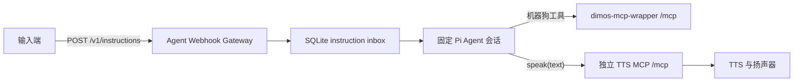

# Agent 输入 Webhook 与 TTS MCP 对接指南

## 1. 当前接入边界

本服务包含两个彼此独立的接口：

1. 输入 Webhook：外部系统通过 `POST /v1/instructions` 提交完整的用户文本。
2. TTS MCP：模型在需要向用户播报时，主动调用 `speak(text)`。

不存在出站回复 Webhook。Agent 最终 assistant 文本只用于结束内部回合，不会自动发送给输入端、硬件或 TTS 服务。

智能项圈使用独立、无鉴权的 `/v1/health-events`、durable health queue 和只读 Health MCP，详见 [Health MCP v0.2 消费端对接指南](health-mcp-consumer-integration.md)。健康通知不得复用本接口。

架构决策见 [ADR-0001](adr/0001-agent-webhook-inbox-and-tts-mcp.md)。



## 2. 双方职责

| 组件 | 负责 | 不负责 |
| --- | --- | --- |
| 输入端 | 生成稳定 `instruction_id`；只提交一次完整、真实的用户文本；按幂等语义重投。 | 不通过机器狗 MCP 注入用户文本；不把 `202` 当作动作或播报完成。 |
| Agent Webhook Gateway | HTTP 校验、SQLite inbox、输入幂等、固定 Agent 会话、机器人 MCP 和可选 TTS MCP 工具注册。 | 不采集音频；不做 ASR；不提供出站回复 Webhook；不确认扬声器物理出声。 |
| TTS MCP | 实现 `speak(text)`，完成 TTS 排队、合成和硬件播放策略，并返回明确的工具结果。 | 不执行机器狗动作；不依赖网关回复回调。 |
| 机器人 MCP | 执行机器狗工具和统一 `stop_all`。 | 不充当输入接口或 TTS 接口。 |

## 3. 输入 Webhook

### 3.1 请求

```http
POST /v1/instructions HTTP/1.1
Content-Type: application/json; charset=utf-8

{
  "instruction_id": "voice-01JABC...",
  "text": "向前移动一米，然后告诉我结果"
}
```

字段约束：

| 字段 | 类型 | 约束 |
| --- | --- | --- |
| `instruction_id` | string | 必填、trim 后非空；同一真实请求的重投必须复用同一值。 |
| `text` | string | 必填、trim 后非空；必须是一条完整用户请求。 |

请求体上限为 64 KiB。只接受 JSON 对象及上述两个字段；不得附加 Agent ID、session ID、MCP 工具名或工具参数。

### 3.2 成功响应

首次受理：

```http
HTTP/1.1 202 Accepted
Content-Type: application/json; charset=utf-8

{
  "instruction_id": "voice-01JABC...",
  "status": "accepted"
}
```

同一 `instruction_id`、完全相同文本重投时，外部响应仍为：

```json
{
  "instruction_id": "voice-01JABC...",
  "status": "accepted"
}
```

网关会在内部日志记录 `instruction.duplicate`，但当前 HTTP 响应不区分首次受理和幂等重投。`accepted` 只表示输入已持久化，不表示 Agent 已完成、机器狗已动作、TTS MCP 已被调用或扬声器已出声。

### 3.3 错误响应

| HTTP | `error` | 含义 |
| --- | --- | --- |
| `400` | `invalid_request` | JSON、字段、类型、`Content-Type` 不合法，或请求体超过 64 KiB。 |
| `404` | `not_found` | 路径不是 `/v1/instructions`。 |
| `409` | `instruction_id_conflict` | 同一 ID 已绑定不同文本。 |

当前入口没有身份校验、签名或重放防护，只能部署在受信任网络，并由 TLS 终止、主机防火墙和网络 ACL 限制访问。

## 4. 调度、停止与恢复

- 普通输入按 SQLite 接收顺序串行进入同一个固定 Agent 会话。
- 相同 ID 和相同文本不会重复运行 Agent。
- 相同 ID 和不同文本返回 `409`。
- 规范化后精确等于“停”或 `stop` 的文本绕过 Agent，单次调用机器人 MCP 的 `stop_all`。
- 停止快速路径不会自动调用 `speak`，也不会生成任何出站回复。
- Agent 或 `stop_all` 失败时，网关记录错误并将输入标记为完成；不会生成固定回退语，也不会自动调用 TTS。
- 进程启动时，遗留的 `processing` 输入直接标记为完成，不重新运行 Agent、机器人工具或 TTS，以避免重复副作用。

停止快速路径只是低延迟的软件路径，不等同于独立物理急停，也不证明机器狗已经静止。

## 5. TTS MCP 契约

### 5.1 启用方式

TTS MCP 是可选配置：

```dotenv
AGENT_WEBHOOK_TTS_MCP_URL=http://127.0.0.1:9992/mcp
AGENT_WEBHOOK_TTS_MCP_TIMEOUT_MS=10000
```

未设置 `AGENT_WEBHOOK_TTS_MCP_URL` 时，固定 Agent 不注册 `speak` 工具，网关仍可启动，但不会产生语音。

配置后，网关向模型注册：

```text
speak(text: string) -> MCP tool result
```

`text` 必须是非空字符串。模型应把完整、直接面向用户的内容一次放入 `text`，包括必要的追问、拒绝、错误说明和动作结果。

### 5.2 项目无状态 HTTP tool-call profile

当前实现复用机器人包装器已经采用的窄化传输：直接向配置的完整 URL 发送 JSON-RPC `tools/call`。它不执行 MCP `initialize`、协议版本协商、`tools/list` 或 session header，因此不能直接等同于任意标准 Streamable HTTP MCP Server。

硬件侧必须实现本文定义的无状态 tool-call profile，或在标准 MCP Server 前增加一个适配器：

```http
POST /mcp HTTP/1.1
Accept: application/json
Content-Type: application/json

{
  "jsonrpc": "2.0",
  "id": 1,
  "method": "tools/call",
  "params": {
    "name": "speak",
    "arguments": {
      "text": "已经完成移动。"
    }
  }
}
```

成功响应示例：

```json
{
  "jsonrpc": "2.0",
  "id": 1,
  "result": {
    "content": [
      {
        "type": "text",
        "text": "{\"status\":\"queued\"}"
      }
    ]
  }
}
```

建议 TTS MCP 在返回值中区分 `queued`、`playing` 或明确失败，但网关只把它视为工具结果。工具成功最多证明 TTS MCP 接受了调用，不证明音频已经从扬声器播放。

以下任一情况会作为工具失败返回给当前 Agent 回合：

- 非 2xx HTTP；
- JSON-RPC `error`；
- 缺少 `result`；
- `result.isError=true`；
- 文本结果使用现有结构化错误格式。

网关不会自动重试失败的 `speak`，避免重复播报。TTS MCP 如需队列、幂等、播放状态或内部重试，应在自己的服务边界内实现。

### 5.3 安全边界

当前 TTS MCP 客户端只发送 `Accept` 和 `Content-Type`，不发送 Bearer token、HMAC 或 mTLS 身份。不要将端点暴露到不受信任网络。若硬件侧需要认证，应先扩展并共同确认 MCP 传输契约。

## 6. 配置

| 环境变量 | 默认值 | 说明 |
| --- | --- | --- |
| `AGENT_WEBHOOK_HOST` | `127.0.0.1` | 输入 Webhook 监听地址。 |
| `AGENT_WEBHOOK_PORT` | `8080` | 输入 Webhook 端口。 |
| `AGENT_WEBHOOK_DATABASE_PATH` | `<cwd>/data/agent-webhook.sqlite` | instruction inbox SQLite 文件。 |
| `AGENT_WEBHOOK_MCP_URL` | `http://127.0.0.1:9991/mcp` | 机器人包装器 MCP 完整 URL。 |
| `AGENT_WEBHOOK_MCP_TIMEOUT_MS` | `120000` | 单次机器人 MCP 调用超时。 |
| `AGENT_WEBHOOK_TTS_MCP_URL` | 未设置 | 独立 TTS MCP 完整 HTTP(S) URL；设置后注册 `speak`。 |
| `AGENT_WEBHOOK_TTS_MCP_TIMEOUT_MS` | `10000` | 单次 TTS MCP 调用超时。 |
| `AGENT_WEBHOOK_AGENT_DIR` | `~/.pi/agent` | Pi Agent 模型和认证目录。 |
| `AGENT_WEBHOOK_SESSION_DIR` | `<cwd>/data/agent-session` | 固定 Agent 会话目录。 |
| `AGENT_WEBHOOK_DEFAULT_SPEED_MPS` | `0.1` | 仅给移动距离时的估算速度。 |

`AGENT_WEBHOOK_TTS_MCP_URL` 必须与 `AGENT_WEBHOOK_MCP_URL` 不同；配置为同一规范化 URL 时启动失败。

最小启动示例：

```powershell
Set-Location "E:/Documents/GitHub/pi-hackason/components/agent-framework/agent-webhook-gateway"
Copy-Item ".env.example" ".env"
$env:AGENT_WEBHOOK_TTS_MCP_URL = "http://tts-device:9992/mcp"
npm.cmd run start:dev
```

## 7. 迁移说明

升级前应删除部署环境中的全部旧回复 Webhook URL、超时和重试配置。代码不再读取这些配置，也不再创建、查询或投递回复 outbox。

为避免未经授权地破坏既有数据，升级不会主动删除旧 SQLite 文件中的历史 `outbox` 表。该表处于惰性遗留状态，新运行时不会读取或写入它。若部署方需要回收空间，应先备份并在独立维护窗口执行数据库迁移。

## 8. 联调验收

输入端：

- [ ] 首次请求返回 `202 accepted`。
- [ ] 相同 ID、相同文本仍返回 `202 accepted`，Agent 只运行一次，日志包含 `instruction.duplicate`。
- [ ] 相同 ID、不同文本返回 `409`。
- [ ] `202` 后不等待任何回复回调。

TTS MCP：

- [ ] 未配置 TTS URL 时，Agent 工具列表中没有 `speak`。
- [ ] 配置后，模型可调用一次 `speak`，硬件侧收到原样 `text`。
- [ ] 机器人 MCP 与 TTS MCP 使用不同 URL。
- [ ] TTS MCP 失败时不会自动重试或重复播报。
- [ ] Agent 最终 assistant 文本不会绕过 `speak` 自动发送。
- [ ] 精确停止快速路径只调用一次 `stop_all`，不会自动调用 `speak`。

本地无硬件验证：

```powershell
Set-Location "E:/Documents/GitHub/pi-hackason/components/agent-framework/agent-webhook-gateway"
npm.cmd run demo:dry-run
```

演示使用临时端口和临时 SQLite，分别替代机器人包装器、机器狗 MCP 和 TTS MCP。它断言普通指令只产生一次机器人调用和一次显式 `speak`，停止快速路径可在 Agent 忙碌时单次调用 `stop_all`，且没有任何回复 Webhook。
