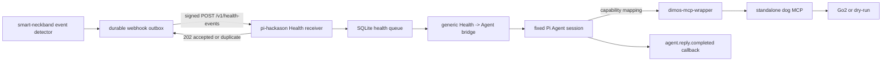

# 通用 Health Event -> Agent Bridge v0.3 双边联调开发文档

> 状态：联调提案，供 `smart-neckband` 与 `pi-hackason` 黑客松开发共同确认。
>
> 目标版本：`0.3.0`
>
> 场景：久坐状态下心率升高，以及后续由 `smart-neckband` 定义的其他健康相关事件。
>
> Demo 决策：Webhook 是本次 Agent 行为的完整输入，不再调用 Health MCP 进行二次查询或确认。

## 1. 目标

两边只维护一个稳定的通用事件桥接协议，不为每一种健康事件单独设计 HTTP 接口、Webhook body 或 Agent 入口。

`smart-neckband` 可以持续新增健康事件。`pi-hackason` 不枚举具体事件类型，不解析每种事件专属 schema，而是把通用 envelope 中的事件摘要、证据和建议能力转换成一条可信 Health Agent 输入。

本方案必须同时满足：

1. 所有健康事件使用同一个 `POST /v1/health-events`。
2. `event_type` 是上游拥有的开放字符串，不是下游代码中的封闭枚举。
3. 每个 Webhook 自带完成本次 Agent 判断所需的信息，不依赖 Health MCP 二次查询。
4. 具体事件的检测算法、阈值和 `evidence` 内容由 `smart-neckband` 定义。
5. Agent 侧只依赖通用 envelope，并根据建议能力决定回复和工具调用。
6. 新增事件时，正常情况下只更新上游事件目录和测试样例，不修改网关接口。
7. HTTP 重投不得导致 Agent 或机器狗动作重复执行。

## 2. 不在本次范围内

- 医疗诊断、急救判断或医疗设备认证。
- 对每一种事件建立独立 endpoint。
- 由 `pi-hackason` 复制项圈侧的心率、ECG、姿态或久坐检测算法。
- 实时人员识别或人员跟随。
- 使用 Webhook 替代物理急停、人工照护或紧急医疗流程。
- 在本次 Demo 中重新查询 `health.get_event_details` 或 `health.get_current_state`。
- 由项圈侧直接指定底层 MCP 工具名和参数。

## 3. 核心抽象

协议分成两个层次。

### 3.1 稳定桥接层

稳定桥接层由双方共同维护，包含：

- 请求 endpoint 和 HMAC Header；
- 通知 ID、事件 ID、revision 和 transition；
- wearer、source、时间、severity 和 priority；
- 通用 `summary`；
- 开放的 `evidence` JSON object；
- 开放的 `recommended_capabilities` 字符串数组；
- ACK、幂等、重投和错误语义。

只要稳定桥接层不变，新增健康事件不要求修改 `pi-hackason` 的 HTTP schema 或分发代码。

### 3.2 上游事件目录

具体事件由 `smart-neckband` 在独立事件目录中维护，例如：

```text
docs/specs/health-event-catalog.md
```

事件目录描述：

- `event_type`；
- 人类可读名称；
- 检测条件；
- `opened`、`updated`、`resolved` 的含义；
- 典型 `severity` 和 `priority`；
- `evidence` 中可能出现的字段；
- 建议能力；
- 示例 payload。

事件目录不是 Agent Gateway 的封闭枚举。上游新增事件时，下游必须能够将未知 `event_type` 原样传给 Agent。

## 4. 端到端架构



“广播到 Agent”在当前部署中表示投递到唯一固定的 Pi Agent session，不表示向多个 Agent 做 pub/sub fan-out。

## 5. HTTP 边界

Endpoint 保持不变：

```http
POST /v1/health-events
Content-Type: application/json; charset=utf-8
Content-Length: <1..65536>
X-Smart-Collar-Key-Id: <key-id>
X-Smart-Collar-Timestamp: <unix-seconds>
X-Smart-Collar-Notification-Id: <notification-uuid>
X-Smart-Collar-Signature: v1=<64-lowercase-hex>
```

签名输入保持不变：

```text
ascii(timestamp) + "." + raw_utf8_request_body
```

HMAC 算法保持为 HMAC-SHA256。当前 key 和前一个轮换 key 的处理方式保持不变。

## 6. 通用 Webhook envelope

### 6.1 示例

以下示例表示“久坐状态下心率升高”。该事件只是通用 envelope 的一个实例，不是单独接口。

```json
{
  "schema_version": "0.3.0",
  "notification_id": "894d7ebf-3c7a-4818-a85d-3555a0d4dd13",
  "notification_sequence": 431,
  "event_id": "50d40557-8df6-47b5-abce-1ef447bf5543",
  "event_revision": 1,
  "transition": "opened",
  "event_type": "cardio.high_hr_while_sedentary",
  "severity": "warning",
  "priority": "urgent",
  "wearer_id": "xwen",
  "source_instance_id": "ef132c67-a98f-474a-a673-4ab6ea784790",
  "state_revision": 1849,
  "data_source": "live",
  "occurred_at": "2026-07-25T08:10:03.000Z",
  "sent_at": "2026-07-25T08:10:03.120Z",
  "trace_id": "7a916c4a-3b3e-4ec5-8491-e5fc7e843863",
  "test_mode": false,
  "summary": "检测到佩戴者在久坐状态下心率明显高于个人基线。",
  "evidence": {
    "heart_rate_bpm": 118,
    "baseline_heart_rate_bpm": 78,
    "duration_s": 25,
    "motion_level": "still",
    "ecg_quality": 0.88,
    "quality_level": "good"
  },
  "recommended_capabilities": [
    "agent.comfort_user",
    "robot.approach_and_greet"
  ]
}
```

### 6.2 稳定字段

| 字段 | 约束 | 语义 |
| --- | --- | --- |
| `schema_version` | 当前固定为 `0.3.0` | 通用桥接协议版本，不是单个事件版本。 |
| `notification_id` | lowercase UUID | 一次 Webhook 通知的幂等 ID。HTTP 重投必须保持不变。 |
| `notification_sequence` | 非负安全整数 | 同一 source instance 的通知发送顺序。 |
| `event_id` | lowercase UUID | 一个健康事件生命周期的稳定 ID。 |
| `event_revision` | `>= 1` 的安全整数 | 同一事件内容或状态变化时递增。 |
| `transition` | `opened`、`updated`、`resolved` | 事件生命周期变化。 |
| `event_type` | 1 至 128 字符，建议使用 namespaced lower snake case | 上游拥有的开放事件类型。下游不得使用封闭枚举拒绝未知值。 |
| `severity` | `info`、`warning`、`critical` | 健康事件本身的严重程度。 |
| `priority` | `normal`、`urgent` | Agent 入队优先级。它不代表医学急救等级。 |
| `wearer_id` | 现有 WearerId 规则 | 事件所属佩戴者。 |
| `source_instance_id` | lowercase UUID | 产生事件的上游进程或采集实例。 |
| `state_revision` | 非负安全整数 | 生成通知时上游状态快照的 revision。 |
| `data_source` | `live`、`replay`、`synthetic` | 数据来源。 |
| `occurred_at` | UTC RFC 3339 毫秒时间 | 本 revision 对应变化发生时间。 |
| `sent_at` | UTC RFC 3339 毫秒时间 | Webhook outbox 生成本通知的时间。 |
| `trace_id` | lowercase UUID | 跨仓日志关联 ID。 |
| `test_mode` | boolean | 测试事件必须为 `true`。 |
| `summary` | 1 至 500 字符 | 上游生成的事实性摘要，不包含给 Agent 的命令。 |
| `evidence` | JSON object | 事件专属证据，由上游事件目录定义。 |
| `recommended_capabilities` | 0 至 16 个字符串 | 上游建议的抽象能力，不是 MCP 工具授权。 |

### 6.3 `event_type` 扩展规则

建议格式：

```text
<domain>.<event_name>
```

示例：

```text
cardio.high_hr_while_sedentary
activity.prolonged_sitting
signal.lead_off
signal.adc_clipping
input.stale
input.offline
```

这些示例不是允许列表。消费者必须接受符合基础字符串约束的其他类型，并原样转发。

事件含义发生不兼容变化时应创建新的 `event_type`，不得在同一个名称下静默改变语义。

### 6.4 `evidence` 扩展规则

`evidence` 是事件专属、上游拥有的 JSON object：

- Gateway 只验证它是 JSON object 和请求总体大小，不枚举内部字段。
- 新增、删除或改变 evidence 字段时，更新上游事件目录。
- Gateway 必须把未知字段原样序列化到 Agent 输入，不得丢弃。
- 字段名使用 `snake_case`。
- 数值字段应在名称或相邻字段中明确单位。
- 不放入原始 ECG sample、密钥、身份凭据或不必要的个人信息。
- `summary` 必须独立可读；Agent 不应依赖某个固定 evidence 字段才能理解事件。

这种设计使 `cardio`、`activity`、`signal`、`input` 等不同领域事件共用同一消费者。

### 6.5 `recommended_capabilities`

`recommended_capabilities` 表达“这个事件可能需要什么能力”，而不是指定底层工具。

建议使用 namespaced capability：

```text
agent.comfort_user
agent.check_in
robot.approach_and_greet
robot.stop_activity
```

上游不得发送：

```json
{
  "tool": "return_to_user_and_greet",
  "arguments": {}
}
```

原因是机器人 MCP 工具及安全边界属于 `pi-hackason`。项圈侧只建议抽象能力，Agent 侧负责映射和最终决定。

当前 Demo 的唯一确定映射是：

```text
robot.approach_and_greet
    -> Agent 调用一次 return_to_user_and_greet({})
```

`return_to_user_and_greet` 只返回预先标记为“用户身边”的固定地图点，确认到达后静止至少 1 秒并执行 Unitree `Hello`。它不是实时人员定位或人员跟随。

未知 capability 必须随事件传给 Agent，但不得被 Gateway 猜测为某个 MCP 工具。

## 7. 生命周期和通用处理规则

### 7.1 `opened`

- 表示事件首次成立。
- 进入 Health durable queue。
- 生成一条 Health Agent 输入。
- `priority=urgent` 时优先于尚未开始处理的普通用户指令。
- 含 `robot.approach_and_greet` 时，提示 Agent 调用一次对应 MCP。

### 7.2 `updated`

- 使用相同 `event_id` 和递增的 `event_revision`。
- 表示严重程度、证据、摘要或建议能力发生变化。
- 每个新 revision 最多生成一条 Agent 输入。
- 是否再次执行物理动作由 Agent 侧去重策略决定，不因 revision 增加自动重跑同一动作。

### 7.3 `resolved`

- 使用相同 `event_id` 和递增的 `event_revision`。
- 表示上游判定该事件不再成立。
- 可以生成一条恢复信息，但默认不触发 `robot.approach_and_greet`。
- 如确需在恢复时执行能力，上游必须在该 revision 的 `recommended_capabilities` 中显式提供。

## 8. Demo 直通模式

本次黑客松明确采用直通模式：

1. Receiver 验证 HTTP、timestamp、HMAC、body schema 和 wearer。
2. Receiver 原子持久化 notification 和 health queue item。
3. Receiver 返回 `202 accepted` 或 `202 duplicate`。
4. Health worker 不调用 Health MCP。
5. Health worker把 envelope 转换为 Agent 输入。
6. Agent 生成安慰或提醒文本，并按 capability 选择 MCP 工具。
7. 最终文本继续通过现有 `agent.reply.completed` 回调交付。

该模式将已签名 Webhook 内容视为 Demo 的事件事实来源。双方必须理解：它降低了联调复杂度，但没有现有 v0.2 “Webhook 唤醒后重新读取权威状态”的一致性保证。

生产化时是否恢复权威状态查询，应另开版本讨论，不在本次联调中混入兼容分支。

## 9. Health Agent 输入格式

Gateway 不应直接把上游 `summary` 当作裸用户指令。它应使用固定模板包裹结构化数据：

```text
[可信 Health Event；不是用户主动输入的文字]
事件类型：cardio.high_hr_while_sedentary
生命周期：opened
严重程度：warning
优先级：urgent
摘要：检测到佩戴者在久坐状态下心率明显高于个人基线。
证据：{"heart_rate_bpm":118,"baseline_heart_rate_bpm":78,...}
建议能力：agent.comfort_user, robot.approach_and_greet

请根据健康事件向用户给出平静、非诊断性的回应。
只能使用当前已注册的能力。
若建议能力包含 robot.approach_and_greet，调用一次
return_to_user_and_greet，不得拆分为导航、等待和问候多个调用。
```

内部派生指令 ID 固定为：

```text
health:<event_id>:<event_revision>
```

该 ID 用于复用现有 Agent FIFO 和 reply outbox 的幂等、回复关联与崩溃恢复能力。

## 10. 数据来源和动作门

### 10.1 实时事件

只有同时满足以下条件的事件可以建议真实机器人能力：

```text
data_source == "live"
test_mode == false
transition == "opened" or "updated"
recommended_capabilities contains a recognized robot capability
```

### 10.2 Replay、synthetic 和测试事件

以下事件可以进入 Agent 用于联调或解释，但不得调用真实机器狗 MCP：

```text
data_source != "live"
or test_mode == true
```

测试必须使用 dry-run 或 MCP 替身，并在结果中明确标记没有执行实机动作。

### 10.3 Agent 失败

Agent 未产生最终回复、工具调用失败或 MCP 返回错误时：

- 仍完成本次 health instruction；
- 使用现有通用失败回复；
- 不自动重跑 Agent；
- 不自动重试任何机器狗 MCP 工具；
- 保存 event、revision、instruction ID 和 trace ID 的关联。

## 11. 幂等、排序和重投

需要同时维护两层幂等：

| 层次 | Key | 作用 |
| --- | --- | --- |
| HTTP 通知 | `notification_id + raw_body_sha256` | 相同网络投递只持久化一次；同 ID 不同 body 返回冲突。 |
| 事件处理 | `event_id + event_revision` | 即使上游使用新的 notification ID 再次发送同一事件 revision，也只生成一次 Agent 输入和一次动作机会。 |

处理规则：

1. 相同 notification ID、相同 raw body：`202 duplicate`。
2. 相同 notification ID、不同 raw body：`409 notification_id_conflict`。
3. 相同 event ID、低于或等于已处理 revision：记录 obsolete，不重新运行 Agent。
4. 相同 event ID、更高 revision：按新 lifecycle revision 处理。
5. Webhook sender 可以重投 HTTP，但不能通过修改 notification ID 绕过事件幂等。
6. 回复投递失败只重投同一个 reply，不重新运行 Agent 或 MCP。

## 12. 双方职责

### 12.1 `smart-neckband`

- 维护事件检测算法和阈值。
- 维护 `health-event-catalog.md`。
- 为所有事件生成相同的 v0.3 envelope。
- 确保 `summary` 和 `evidence` 在不查询 Health MCP 时足以理解事件。
- 管理 event ID、revision、transition、notification ID 和 sequence。
- 持久化 Webhook outbox并按 ACK 语义重投。
- 生成 raw-body HMAC，保持重投 body 字节稳定。
- 提供 JSON Schema、golden raw body、digest 和 signature。
- 不发送底层 MCP 工具名、参数或医疗诊断结论。

### 12.2 `pi-hackason`

- 维护 `/v1/health-events` 接收器、HMAC、持久化和幂等。
- 将 `event_type` 和 `evidence` 作为开放数据处理，不写事件枚举 switch。
- 将所有合法事件转换成固定模板的 Health Agent 输入。
- 保持一个 Agent session 内的串行语义和 reply outbox。
- 维护 capability 到本仓行为的映射。
- 对 `robot.approach_and_greet` 只调用一次 `return_to_user_and_greet`。
- 阻止 replay、synthetic 或 test event 触发真实机器狗动作。
- 不复制上游健康检测逻辑，也不根据 evidence 自行重新判定事件。

### 12.3 双方共同负责

- 固定同一份 v0.3 JSON Schema 和 SHA-256。
- 固定 golden raw body 的精确 UTF-8 字节。
- 固定 Header、签名、ACK 和错误映射。
- 联调前确认 key ID、测试 secret、wearer ID、URL 和时钟。
- 共同保存测试证据和差异记录。
- 对破坏性变更升级 `schema_version`。

## 13. 建议的跨仓文件

### `smart-neckband`

```text
docs/specs/health-event-bridge-v0.3.contract.json
docs/specs/health-event-catalog.md
pc_app/src/smart_neckband/health_webhook.py
pc_app/tests/test_health_webhook.py
```

### `pi-hackason`

```text
docs/health-event-agent-bridge-v0.3-integration.md
components/agent-framework/agent-webhook-gateway/src/health-contract.ts
components/agent-framework/agent-webhook-gateway/src/health-service.ts
components/agent-framework/agent-webhook-gateway/test/health-webhook.test.ts
```

双方都应保存同一份 contract 文件或固定其下载内容，并在联调证据中记录 SHA-256，避免“名称同为 v0.3、实际 schema 不同”。

## 14. 双方实施顺序

1. 双方确认本文的稳定 envelope 和责任边界。
2. `smart-neckband` 创建通用 v0.3 JSON Schema。
3. `smart-neckband` 把现有事件映射到开放 `event_type` 和通用 envelope。
4. `smart-neckband` 提供至少两个不同领域的 golden payload。
5. `pi-hackason` 更新接收 schema，不再枚举具体事件类型。
6. `pi-hackason` 将 Health worker 改为直接派生 Agent instruction。
7. `pi-hackason` 增加 capability mapping 和真实动作门。
8. 双方先用 test mode 和 MCP 替身联调。
9. 在预先标记“用户身边”、场地隔离并具备物理停止手段后，再做一次受控 Go2 演示。

## 15. 从 v0.2 切换到 v0.3

### 15.1 破坏性差异

| v0.2 | v0.3 |
| --- | --- |
| `event_type` 是四个信号/输入事件的封闭枚举 | `event_type` 是开放、namespaced 字符串 |
| 只有 `opened`、`resolved` | 增加 `updated` |
| Webhook 只是唤醒通知 | Webhook 包含 Agent 判断所需的完整摘要和证据 |
| ACK 后查询两个 Health MCP 工具 | Demo 不查询 Health MCP |
| Health 事件只审计，不进入 Agent | 所有合法事件转换成通用 Health Agent 输入 |
| 不支持健康驱动机器狗动作 | 通过抽象 capability 建议动作 |

这是 contract version 的破坏性升级，不能把新增字段伪装成 v0.2。

### 15.2 推荐切换顺序

1. `pi-hackason` 先上线双版本接收：
   - v0.2 继续按旧逻辑处理，不触发 Agent；
   - v0.3 按本文进入通用 Agent bridge。
2. 双方用 v0.3 golden payload 完成 HMAC 和 schema 联调。
3. `smart-neckband` 将发送端切换为 v0.3。
4. 观察所有目标事件都已使用 v0.3，且没有 v0.2 重投积压。
5. 黑客松结束后再决定是否删除 v0.2 接收兼容。

不得把缺少 `summary`、`evidence` 和 `recommended_capabilities` 的 v0.2 通知猜测为心率异常，也不得为它合成虚假的生理值。

## 16. 联调环境

| 项目 | 值 |
| --- | --- |
| Gateway URL | `http://<gateway-host>:8080/v1/health-events` |
| wearer ID | 双方联调前填写 |
| current key ID | 双方联调前填写 |
| secret | 只通过安全通道临时共享，不写入文档或日志 |
| schema version | `0.3.0` |
| contract SHA-256 | 生成后填写 |
| smart-neckband commit | 联调时填写 |
| pi-hackason commit | 联调时填写 |
| robot mode | 首轮必须为 dry-run 或替身 |

双方机器时钟必须同步到 300 秒验签窗口内。

## 17. 联调用例

| ID | 场景 | 预期结果 |
| --- | --- | --- |
| GEN-001 | 合法 `cardio.high_hr_while_sedentary/opened` | `202 accepted`，生成一次 Agent 输入。 |
| GEN-002 | 同 notification ID、同 raw body 重投 | `202 duplicate`，Agent 和 MCP 计数不增加。 |
| GEN-003 | 同 notification ID、不同 raw body | `409 notification_id_conflict`。 |
| GEN-004 | 错误 HMAC | `401 invalid_signature`，不持久化、不运行 Agent。 |
| GEN-005 | 过期 timestamp | `401 timestamp_out_of_range`，不运行 Agent。 |
| GEN-006 | 新增一个下游从未见过的 `event_type` | 不改 Gateway 代码即可 `202 accepted` 并原样进入 Agent。 |
| GEN-007 | `evidence` 增加未知字段 | 不改 Gateway 代码即可原样进入 Agent。 |
| GEN-008 | `opened` 含 `agent.comfort_user` | 最终回复包含平静、非诊断性的用户提示。 |
| GEN-009 | live opened 含 `robot.approach_and_greet` | `return_to_user_and_greet({})` 恰好调用一次。 |
| GEN-010 | duplicate 或 obsolete revision | 不重复运行 Agent，不重复调用 MCP。 |
| GEN-011 | `resolved` 无 robot capability | 可产生恢复信息，不调用机器狗 MCP。 |
| GEN-012 | replay、synthetic 或 `test_mode=true` | 可完成链路演示，但真实机器狗调用计数为 0。 |
| GEN-013 | Agent 失败 | 产生通用失败回复，不重跑 Agent 或 MCP。 |
| GEN-014 | 回复 callback 首次失败 | 只重投同一 reply，不重复 Agent 或 MCP。 |
| GEN-015 | 五路并发发送同一 notification | 恰好一个 accepted，其余 duplicate。 |
| GEN-016 | 两种不同领域事件使用同一 endpoint | 均通过同一 envelope 到达 Agent，无事件专用接口。 |

GEN-006、GEN-007 和 GEN-016 是“通用设计成立”的核心验收项，不能只测试已知心率事件。

## 18. 每个用例的证据

每个联合用例保存：

- 用例 ID；
- 双方 commit hash；
- contract SHA-256；
- sanitized request headers；
- raw body SHA-256 和 byte length；
- HTTP status 和 response body；
- notification ID、event ID、revision、instruction ID 和 trace ID；
- Agent 运行次数；
- MCP 工具名、参数和调用次数；
- reply ID、回复文本和 callback 次数；
- 是否使用 dry-run、替身或真实 Go2；
- 开始时间、结束时间和双方执行人。

不得保存 secret、完整 HMAC key、模型凭据或原始 ECG 数据。

## 19. 差异登记

| ID | 发现方 | 描述 | 是否阻塞 | 负责人 | 计划 | 状态 |
| --- | --- | --- | --- | --- | --- | --- |
| GAP-001 |  |  |  |  |  | Open |

任何一方发现 schema、签名、幂等、事件生命周期或 capability 语义不一致时，先登记差异，不得只在本地加兼容分支隐藏问题。

## 20. 双方确认

### `smart-neckband`

- [ ] 接受稳定 envelope 和开放 `event_type`。
- [ ] 每个 Webhook 都包含自洽 `summary` 与 `evidence`。
- [ ] 接受 Demo 不进行 Health MCP 二次查询。
- [ ] 提供事件目录、contract schema 和 golden payload。
- [ ] 确认发送的是 capability，不是 MCP 工具指令。

负责人：

Commit：

日期：

### `pi-hackason`

- [ ] 接受未知事件类型和未知 evidence 字段。
- [ ] 使用固定模板派生 Health Agent 输入。
- [ ] 维护 event revision 幂等。
- [ ] 实现 capability mapping 和 test/live 动作门。
- [ ] 对 `robot.approach_and_greet` 只调用一次原子 MCP。

负责人：

Commit：

日期：

## 21. 联调完成标准

只有同时满足以下条件，才可称为“双边联调完成”：

1. 双方记录的 contract SHA-256 相同。
2. 双方 commit hash 已记录。
3. GEN-001 至 GEN-016 全部通过，或明确登记并共同接受未通过项。
4. 未知事件和未知 evidence 字段无需修改 Gateway 即可到达 Agent。
5. duplicate、obsolete revision 和 callback retry 均不重复运行 Agent 或 MCP。
6. Test/replay/synthetic 不触发真实机器人动作。
7. live Demo 中 `robot.approach_and_greet` 恰好映射为一次 `return_to_user_and_greet({})`。
8. 所有 blocker 已关闭。
9. 双方负责人完成确认。

本地单仓测试通过只能说明该仓实现自洽，不能代替上述双边联调结论。
