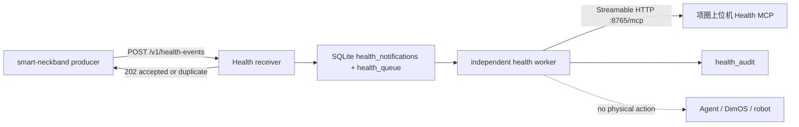

# 智能项圈 Health MCP v0.2 消费端对接指南

> 契约版本：`0.2.0`
>
> 实现位置：`components/agent-framework/agent-webhook-gateway`
>
> 实现边界：本仓库只实现 Health Webhook 接收方和 Health MCP 消费方；项圈采集、状态构建、事件生成、outbox 发送和 Health MCP Server 属于上游 `smart-neckband` 仓库。

历史的签名契约核对项保存在 [Health MCP v0.2 双方实现核对与联调验收清单](health-mcp-v0.2-cross-team-verification-checklist.md)。该清单中的鉴权相关条目已被结赛联调无鉴权覆盖取代，不再代表当前 Gateway 行为。

## 1. 交付范围

当前实现提供：

1. 独立的 `POST /v1/health-events`，不复用 `/v1/instructions`。
2. 64 KiB raw body 上限、严格 Content-Type/Content-Length、禁止 chunked transfer。
3. Health MCP v0.2 `WebhookRequest` 的严格字段、类型、枚举、时间和 `additionalProperties` 校验。
4. SQLite `BEGIN IMMEDIATE`、唯一键和 raw-body SHA-256 实现的原子幂等。
5. 与普通 Agent FIFO 分离的 durable health queue。
6. ACK 后依次查询 `health.get_event_details` 和 `health.get_current_state`。
7. 固定代码检查 contract version、event revision、wearer、source instance、`data_source=live`、`test_mode=false` 和 `freshness=fresh`。
8. 审计处理结果；v0.2 所有健康通知的策略结果均为不执行物理动作。

当前实现不提供：

- Health MCP Server、ECG/IMU 采集、状态构建或健康事件算法；
- Health Webhook 发送端、发送 outbox、重试或 dead letter；
- HRV、运动/姿态分类、诊断或医疗判断；
- Health 事件到 Agent 文本、DimOS 工具或机器狗动作的映射；
- Health MCP Server 的 HTTP 监听实现；项圈上位机必须自行提供 MCP 2025-11-25 Streamable HTTP endpoint。

## 2. 数据流和安全边界



Webhook body 只是唤醒通知。接收方 ACK 后重新查询 Health MCP；Webhook 中的 event revision 不能替代 MCP 权威状态。Health worker 不进入普通用户指令 FIFO，不等待 LLM，也不会调用机器狗 MCP。

## 3. 启用配置

未配置任何当前支持的 `AGENT_WEBHOOK_HEALTH_*` 环境变量时，Health 接收端关闭，`/v1/health-events` 返回普通 `404`。启用时必须同时设置 `AGENT_WEBHOOK_HEALTH_WEARER_ID` 和 `AGENT_WEBHOOK_HEALTH_MCP_URL`；任一缺失都会在 Gateway 监听端口前失败。旧 key/secret 环境变量已移除并被忽略。

```powershell
$env:AGENT_WEBHOOK_HEALTH_WEARER_ID = "xwen"
$env:AGENT_WEBHOOK_HEALTH_MCP_URL = "http://项圈上位机IP:8765/mcp"
```

| 环境变量 | 必填 | 默认值 | 说明 |
| --- | --- | --- | --- |
| `AGENT_WEBHOOK_HEALTH_WEARER_ID` | 启用时 | 无 | 单实例允许的 wearer ID，必须符合 v0.2 `WearerId`。 |
| `AGENT_WEBHOOK_HEALTH_MCP_URL` | 启用时 | 无 | 项圈上位机暴露的 MCP 2025-11-25 Streamable HTTP URL。 |
| `AGENT_WEBHOOK_HEALTH_MCP_TIMEOUT_MS` | 否 | `10000` | initialize 和 tools/call 的单次超时。 |
| `AGENT_WEBHOOK_HEALTH_RETRY_BASE_MS` | 否 | `1000` | MCP transport 或可重试领域失败后的队列重试基数。 |
| `AGENT_WEBHOOK_HEALTH_RETRY_MAX_MS` | 否 | `60000` | 本地指数退避上限；上游合法 `retry_after_ms` 可以延长等待。 |

当前 Health Webhook 和 Gateway 发往 Health MCP 的请求都没有任何鉴权配置。Gateway 不发送 `Authorization`，不要为本次联调生成或分发 key、secret、token 或签名。两台机器必须位于受信任内网，并由主机防火墙限制访问。

## 4. HTTP 契约

Endpoint：

```http
POST /v1/health-events
Content-Type: application/json; charset=utf-8
Content-Length: <1..65536>
X-Smart-Collar-Notification-Id: <notification-uuid>
```

`Accept`、`User-Agent` 以及旧版 key/timestamp/signature Header 都会被忽略。当前入口不执行身份校验、签名校验或重放时间窗检查。

新通知在 notification 和独立 queue row 同一个 transaction 提交后返回：

```http
HTTP/1.1 202 Accepted
Content-Type: application/json; charset=utf-8
```

```json
{
  "notification_id": "894d7ebf-3c7a-4818-a85d-3555a0d4dd13",
  "status": "accepted"
}
```

同 ID、同 raw-body SHA-256 返回 `202 duplicate`。同 ID、不同 digest 返回：

```http
HTTP/1.1 409 Conflict
```

```json
{"error":"notification_id_conflict"}
```

其他错误映射为：`405 method_not_allowed`、`404 not_found`、`415 unsupported_media_type`、`400 invalid_request`、`413 body_too_large` 和 `503 internal_error`。`405` 同时返回 `Allow: POST`。

## 5. Health MCP 消费

网关不会在地瓜派启动 `smart_neckband.health_mcp`。它通过 `AGENT_WEBHOOK_HEALTH_MCP_URL` 连接项圈上位机，按 MCP 2025-11-25 Streamable HTTP 完成：

```text
initialize(protocolVersion=2025-11-25)
notifications/initialized
```

每条 JSON-RPC 消息使用一个 HTTP POST。Gateway 接受 `application/json` 和 `text/event-stream` 响应，保存初始化响应中的可选 `MCP-Session-Id`，并在后续请求携带该 session 与 `MCP-Protocol-Version: 2025-11-25`。session 返回 `404` 时会失效并在队列下次重试时重新 initialize。

每条首次受理的 notification 依次调用：

```text
health.get_event_details(event_id)
health.get_current_state(wearer_id, max_age_ms=2000)
```

每个 `tools/call` 结果必须：

- 含且只含一个 `TextContent`；
- 含 `structuredContent` 和 boolean `isError`；
- `TextContent.text` 能解析为 JSON；
- 解析后的 JSON 与 `structuredContent` 深度相等。

HTTP transport、session 失效、timeout，或带 `retryable=true` 的领域失败会把 health queue item 恢复为 pending，并取本地指数退避与 `retry_after_ms` 的较大值。不可重试的领域失败、JSON-RPC/结果契约不匹配、非 live/test 数据、事件不匹配或非 fresh state 会记录审计并停止本次处理，不使用旧状态替代。

项圈上位机的当前 `smart-neckband-health-integration` 检出版本只提供 stdio server；在真实跨机部署前，上游必须先启用其规划中的 `http://<health-host>:8765/mcp` Streamable HTTP transport。仅在地瓜派增加 URL 无法把 stdio 进程自动变成网络服务。

`verified_no_action` 表示：

- event 和 state 已通过上述固定检查；
- 本次通知已经完成消费端审计；
- 没有调用 Agent、DimOS 或任何机器狗工具。

它不表示健康正常、医学安全或外部动作完成。

## 6. 验证

不需要 DIMOS、模型、真实项圈或机器狗：

```powershell
Set-Location "C:/absolute/path/to/pi-hackason/components/agent-framework/agent-webhook-gateway"
node node_modules/vitest/dist/cli.js --run test/health-webhook.test.ts
node node_modules/vitest/dist/cli.js --run test/health-mcp-client.test.ts
npm run check
```

自动化测试覆盖无鉴权请求、旧鉴权 Header 忽略行为、验证顺序、错误映射、并发幂等、raw-body 冲突、MCP initialize、远程 Streamable HTTP session/headers/SSE、无 `Authorization`，以及 TextContent/structuredContent 一致性。现有跨仓库 fixture 仍通过 stdio 验证上游业务工具契约，但生产 CLI 不使用该路径。测试只使用临时端口和临时 SQLite。
